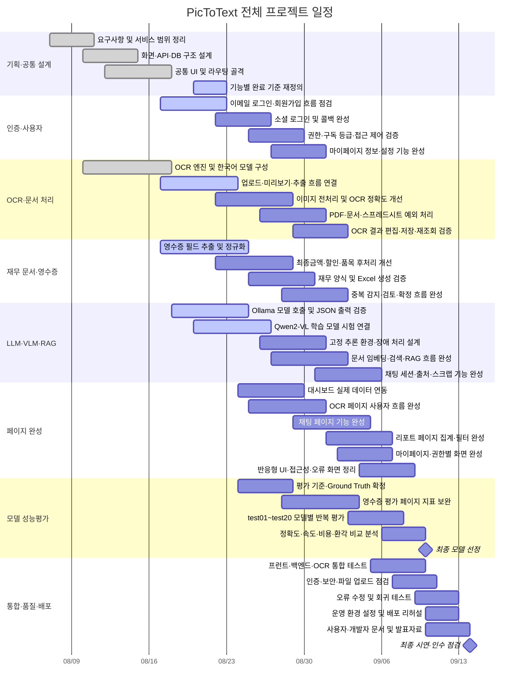

# PicToText 프로젝트 간트차트

## 1. 프로젝트 개요

- 프로젝트 기간: 2026-08-07 ~ 2026-09-14
- 기준일: 2026-08-21
- 대상 범위: `frontend`, `backend`, `ocr`, 데이터베이스·Supabase, Ollama·Qwen-VL, 테스트, 배포 및 문서화
- 상태 판단 원칙: 화면이나 API 파일이 존재하더라도 실제 사용자 흐름과 데이터 연동이 검증되지 않았다면 완료로 보지 않는다.
- 현재 상태: 주요 페이지의 UI 골격은 있으나, OCR 및 영수증 평가를 제외한 다수 기능은 완성도 점검과 통합 작업이 필요하다.

## 2. 전체 일정

## 3. 주차별 목표와 산출물

| 주차 | 기간 | 목표 | 주요 작업 | 산출물 |
|---|---|---|---|---|
| 1주차 | 8/7~8/13 | 프로젝트 기반 정의 | 요구사항, 역할, 기술 스택, 화면·API·DB 구조 설계 | 요구사항 목록, 화면 흐름도, 시스템 구성도 |
| 2주차 | 8/14~8/20 | 전체 기능 골격 구축 | 프런트 라우팅, 공통 UI, 백엔드 라우트, OCR 엔진, DB 연결 기반 구성 | 페이지 골격, API 골격, OCR 실행 환경 |
| 3주차 | 8/21~8/27 | 핵심 기능 우선 완성 | OCR 업로드·저장, 영수증 정규화, 인증 점검, Qwen-VL 시험 연결, 대시보드 데이터 연동 | OCR 핵심 흐름, 영수증 추출 결과, 모델 연결 검증 |
| 4주차 | 8/28~9/3 | 페이지별 실제 기능 완성 | 채팅·RAG, 재무 문서, 마이페이지, 리포트, 예외 처리, 평가 지표 구현 | 기능이 연결된 주요 페이지, 평가 가능한 모델 출력 |
| 5주차 | 9/4~9/10 | 평가 및 통합 안정화 | test01~test20 평가, 모델 비교, 통합 테스트, 반응형 UI, 보안 점검 | 모델 평가표, 오류 목록, 통합 테스트 결과 |
| 6주차 | 9/11~9/14 | 최종 품질 확보 | 회귀 테스트, 배포 리허설, 문서화, 발표·시연 준비 | 최종 실행본, 사용자·개발자 문서, 발표자료 |

## 4. 기능 영역별 완료 기준

| 영역 | 현재 판단 | 완료 기준 |
|---|---|---|
| 로그인·회원가입 | 부분 구현 | 이메일 인증, 오류 메시지, 세션 유지, 로그아웃까지 실제 계정으로 검증 |
| 소셜 로그인 | 미완성 | 공급자 설정, 콜백, 신규·기존 사용자 처리 및 실패 흐름 검증 |
| 대시보드 | UI 골격 중심 | 문서·OCR·재무·사용량 통계가 실제 데이터와 일치 |
| OCR 페이지 | 핵심 개발 진행 중 | 이미지·PDF 업로드부터 추출, 수정, 저장, 재조회까지 정상 동작 |
| 재무 문서 | 부분 구현 | 영수증 필드 정확도 확보, 검토·확정·중복 처리 및 Excel 검증 완료 |
| AI 채팅·RAG | 부분 구현 | 업로드 문서 인덱싱, 검색 근거, 답변, 세션·스크랩이 일관되게 동작 |
| 리포트 | UI·API 점검 필요 | 실제 평가 데이터 집계, 기간·조건 필터, 권한별 조회 검증 |
| 마이페이지 | 부분 구현 | 사용자 정보, 설정, 구독·권한 표시와 변경 가능 항목 검증 |
| 영수증 모델 평가 | 개발·연결 진행 중 | 동일 20건으로 정확도·속도·실패율을 반복 측정하고 결과 저장 |
| 배포·운영 | 미완성 | 환경변수·비밀값 분리, HTTPS, 로그, 백업, 장애 복구 절차 마련 |

## 5. 우선순위

### P0 — 서비스 시연에 반드시 필요

1. OCR 업로드 → 추출 → 결과 저장 흐름
2. 영수증 필드 추출 → 재무 문서 → Excel 생성 흐름
3. 로그인과 사용자별 데이터 접근 제어
4. 모델 호출 실패·타임아웃·잘못된 JSON 처리
5. 주요 사용자 흐름 통합 테스트

### P1 — 프로젝트 평가 품질에 필요

1. test01~test20 Ground Truth 확정
2. LLM/VLM 동일 조건 비교평가
3. 최종금액·할인·품목·카드번호 평가 로직
4. JSON 스키마와 누락·환각 검사
5. 대시보드·리포트 실제 데이터 연동

### P2 — 핵심 완료 후 진행

1. 소셜 로그인 공급자 확대
2. UI 세부 애니메이션과 시각적 개선
3. 운영 환경 자동 확장
4. 부가적인 사용자 편의 기능

## 6. 주요 마일스톤

| 날짜 | 마일스톤 | 확인 기준 |
|---|---|---|
| 8/21 | 중간 상태 재점검 | 모든 페이지를 완료·부분 구현·미구현으로 재분류 |
| 8/27 | 핵심 OCR·영수증 흐름 연결 | 실제 영수증 1건이 업로드부터 재무 결과까지 처리됨 |
| 9/3 | 주요 페이지 기능 완성 | 페이지 골격이 아닌 실제 API·데이터 연동 완료 |
| 9/7 | 20건 모델 평가 완료 | 모델별 동일 데이터 평가 결과 확보 |
| 9/10 | 최종 모델 및 서비스 범위 확정 | 품질 기준과 시연 범위 동결 |
| 9/12 | 배포 후보 확정 | 치명적 오류 없이 통합 시나리오 통과 |
| 9/14 | 최종 시연 및 종료 | 최종 산출물 제출과 인수 점검 완료 |

## 7. 일정 위험요소

- Qwen-VL을 Colab 임시 터널로 연결하면 런타임 종료와 URL 변경으로 평가가 중단될 수 있다.
- OCR 오인식은 LLM 정확도와 재무 필드 후처리에 연쇄적으로 영향을 준다.
- 페이지 파일이 존재하는 것과 실제 기능이 완성된 것은 다르므로 화면별 완료 기준을 반드시 검증해야 한다.
- Supabase, PostgreSQL, Ollama, OCR 서버 중 하나라도 중단되면 통합 시나리오가 실패할 수 있다.
- 모델 성능평가는 동일 이미지, 동일 프롬프트, 동일 스키마와 동일 실행 환경을 유지해야 비교 의미가 있다.
- 마지막 주에 기능을 추가하면 회귀 테스트 시간이 부족하므로 9월 10일 이후에는 범위를 동결한다.

## 8. 일일 진행 관리 규칙

- 각 작업은 `대기`, `진행 중`, `검토 중`, `완료`, `차단` 중 하나로 표시한다.
- 완료는 코드 작성이 아니라 실제 사용자 시나리오와 테스트 통과를 기준으로 한다.
- 차단 작업은 원인, 담당자, 필요한 조치와 목표 해제일을 함께 기록한다.
- 매일 종료 전에 다음 날 P0 작업을 한 개 이상 지정한다.
- 9월 3일부터는 신규 기능보다 오류 수정과 통합 안정화를 우선한다.
