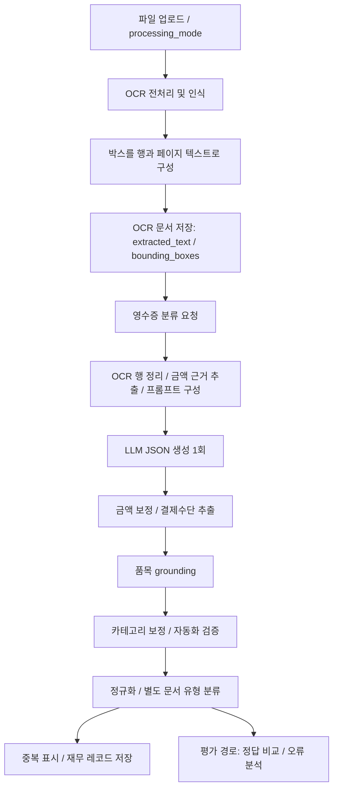

# 현재 영수증 처리 파이프라인

작성일: 2026-09-06. 저장소의 현재 구현을 기준으로 OCR 입력부터 영수증 구조화, 검증, 저장, 평가까지 설명한다. 실행 환경의 모델 설정이나 최근 평가 결과를 검증한 문서는 아니다.

## 1. 전체 흐름



운영 분류는 저장된 OCR 결과를 읽는다. 분류 요청 자체가 원본 이미지의 OCR을 다시 실행하는 구조는 아니다. 평가도 저장된 OCR 텍스트와 페이지 정보를 입력으로 사용할 수 있다.

## 2. OCR 입력 생성과 저장

관련 파일:

- [backend/app/api/routes/ocr.py](../backend/app/api/routes/ocr.py): OCR 서비스로 파일과 `processing_mode` 전달. 기본값은 `document`.
- [ocr/app/services/ocr/ocr_service.py](../ocr/app/services/ocr/ocr_service.py): 파일 처리, 전처리 선택, OCR 실행 및 결과 구성.
- [ocr/app/services/preprocess_service.py](../ocr/app/services/preprocess_service.py): 일반 이미지 전처리.
- [ocr/app/services/receipt_preprocess_service.py](../ocr/app/services/receipt_preprocess_service.py): 영수증 전용 전처리와 기하 변환 정보 관리.
- [ocr/app/services/ocr/ocr_parser.py](../ocr/app/services/ocr/ocr_parser.py): 인식 박스를 행으로 묶고 페이지 텍스트 생성.
- [ocr/app/services/receipt_table_service.py](../ocr/app/services/receipt_table_service.py): 영수증 영역 및 표 탐지.
- [backend/app/services/supabase_document_finance_repository.py](../backend/app/services/supabase_document_finance_repository.py): OCR 결과 저장.

이미지 처리 분기에서 `processing_mode == "receipt"`이면 `preprocess_receipt_image()`를 사용하고, 그렇지 않으면 `preprocess_image()`를 사용한다. 파일 형식별 경로가 있으므로 모든 입력이 동일한 전처리를 거친다고 가정하면 안 된다.

페이지 텍스트는 빈 줄 두 개로 연결되어 `extracted_text`에 저장된다. 페이지의 박스·구조 정보는 후속 처리에 전달된다. 라벨과 숫자가 다른 행으로 분리되거나 읽기 순서가 바뀌면, 이후 금액 정규식과 품목 판정의 입력도 달라진다.

## 3. 운영 분류 진입점

[backend/app/api/routes/finance.py](../backend/app/api/routes/finance.py)의 `POST /records/classify`가 담당한다. 경로는 라우터 내부 기준이다.

1. 영수증 모델 설정과 저장된 OCR 텍스트 유무를 확인한다.
2. 기존 재무 기록을 조회하고 영수증 지문·식별 키로 중복 후보를 찾는다.
3. `_classify_receipt_serialized()`가 프로세스 내부 `asyncio.Lock`으로 분류 요청을 직렬화한다.
4. `_classify_receipt()`에 텍스트, 파일명, `bounding_boxes`를 전달한다.
5. `_normalize()`로 저장 형태를 만든다.
6. 중복 정보, 프롬프트 버전, 처리 시각을 붙이고 재무 기록을 저장한다.
7. 요청의 `save_to_archive`가 참이고 중복이 아니면 아카이브에도 저장한다.

중복은 기존 결과를 그대로 반환하는 캐시가 아니다. 현재 모델로 분석한 기록에 이전 기록과의 관계를 표시한다. 분류 제한 시간에는 잠금 대기도 포함된다.

## 4. LLM 추출과 후처리의 정확한 순서

핵심 구현은 [finance_receipt_simple.py](../backend/app/services/finance_receipt_simple.py)에 있다.

```text
_classify_receipt_with_model()
  → _simple_receipt_prompt()
  → _generate_receipt_json()                 # LLM 호출
  → json.loads() / 객체 여부 검사
  → _reconcile_amounts()                    # 공급가액·세액·총액 보정
  → _payment_from_ocr()                     # 결제수단 추출
  → ground_items()                         # 품목 근거 확인 및 보정
  → _simple_validation()                   # 카테고리 보정과 검증
  → llm_trace 구성

_normalize()
  → 카테고리 재정규화 / 품목 정리
  → classify_document_type()               # 문서 유형 분류
  → 검토 사유 병합 / 수량·카드번호·결제수단 처리
  → 저장용 필드와 structured_data 구성
```

정상 추출 경로는 JSON 생성 1회이며, 검증을 위한 두 번째 LLM 호출은 없다. 운영용 `_classify_receipt()`는 추출 예외를 잡아 `LLM_CALL_FAILED`와 `REVIEW` 결과를 만든다. 평가 경로는 `_classify_receipt_with_model()`을 직접 호출하므로 예외 처리 경계가 다르다.

### 프롬프트 입력

- 모델은 이미지가 아닌 OCR 텍스트를 받는다. `pages`는 생성 이후 처리에 사용된다.
- OCR 행을 정리하고 행 ID를 부여한다.
- OCR 본문 제한은 `MAX_OCR_PROMPT_CHARS = 8000`이다. 전체 프롬프트 길이 제한과는 다르다.
- 긴 입력에서는 앞부분, 뒷부분, 금액 포함 행을 우선 후보로 삼는다. 원래 행 순서로 예산을 채우므로 끝부분이 반드시 모두 보존되는 것은 아니다.
- 규칙으로 추출한 금액 근거와 14개 카테고리 정책을 프롬프트에 포함한다.
- 반환 필드는 상호, 날짜, 카테고리, 공급가액, 세액, 할인액, 총액, 품목이다.

## 5. 카테고리와 문서 유형

### 지출 카테고리

[finance_taxonomy.py](../backend/app/constants/finance_taxonomy.py)는 허용 카테고리, 정책 문구, 레거시 별칭, 문맥 보정 규칙을 정의한다.

`normalize_expense_category()`는 표기와 별칭을 정규화하고, 알 수 없는 값은 `None`으로 반환한다. `refine_expense_category()`는 정규화된 결과에 문맥 규칙을 적용한다.

- 식사·장보기·카페 세 범주 사이에서는 음식점 POS, 메뉴, 마트, 카페 신호의 점수를 비교한다.
- `취미/쇼핑`, `교통` 같은 일부 레거시 입력에는 별도 문맥 보정이 있다.
- 모든 카테고리를 임의의 다른 카테고리로 재분류하는 범용 규칙은 아니다.

보정 근거는 `_category_evidence_text()`가 만든 **OCR 전체 텍스트 + 상호 + 현재 품목명**이다. 동일 단어가 OCR과 추출 품목에 반복될 수 있으므로, 단순 키워드 출현 횟수가 보정 점수에 영향을 줄 수 있다.

### 문서 유형

[receipt_document_classifier.py](../backend/app/services/receipt_document_classifier.py)의 `classify_document_type()`이 담당한다. 운영 `_normalize()`는 이 함수를 호출하므로 카테고리 매핑만으로 문서 유형을 확정하지 않는다.

- 강한 문맥 규칙과 카테고리 매핑으로 대체값을 준비한다.
- 분류기 아티팩트가 있으면 특징 텍스트로 `predict_proba()`를 실행한다.
- 유형별 신뢰도 기준을 충족하면 모델 예측을 선택한다.
- 아티팩트 부재, 낮은 신뢰도, 강한 규칙과의 충돌, 운영 검증 미완료 등은 검토 사유가 된다.
- 결과는 `classification_decision`에 기록된다.

`finance_taxonomy.py`의 `validate_classification()`과 이 경로를 혼동하지 않아야 한다. 수동 수정 API 등은 별도 검증 경로를 사용한다.

## 6. 공급가액·부가세 처리

`_extract_amount_evidence()`가 공급가액, 과세 공급액, 면세액, 부가세, 결제금액 등의 OCR 라벨과 숫자를 읽고, `_reconcile_amounts()`가 모델 결과를 보정한다. 모델이 출력한 숫자가 그대로 저장되는 구조는 아니다.

주요 동작은 다음과 같다.

- 명시적 OCR 공급가액·세액을 우선 적용한다.
- 조건을 충족하면 과세 공급액과 면세액을 합쳐 공급가액을 구성한다.
- 총액이 확인되고 충돌·추가 세금·불완전 근거·할인 기준 불명확 등의 차단 조건이 없으면 총액에서 명시적 세액 또는 공급가액을 빼는 산술 보정을 허용한다.
- 과세로 판단되고 추가 조건을 충족하면 `round(total / 11)`로 세액을 계산하는 분기가 있다. 모든 거래에 적용하는 공식은 아니다.
- 불확실한 값은 미해결 상태로 남기고 검토 사유를 기록한다.
- 금액 합 관계 검증의 허용 오차 상수는 10이다.

진단 결과는 `amount_resolution`에 저장된다. `tax_treatment`, `supply_source`, `tax_source`, `amount_sources`, `changes`를 확인하면 값의 출처와 변경 경로를 추적할 수 있다.

대표 검토 사유는 `OCR_AMOUNT_CONFLICT`, `TOTAL_AMOUNT_UNCONFIRMED`, `MIXED_TAX_COMPONENTS_UNRESOLVED`, `DISCOUNT_TAX_BASIS_UNCLEAR`, `TAX_AMOUNTS_UNRESOLVED`, `AMOUNT_RELATION_MISMATCH`이다.

현재 구현에서 주의할 점: `treatment == "EXEMPT"` 분기가 바깥의 `treatment == "TAXABLE"` 조건 안에 중첩되어 있다. 이 중첩 위치에서는 면세 분기에 도달할 수 없으므로, 면세 총액을 공급가액으로 보완하고 세액을 0으로 설정하는 동작이 항상 수행된다고 문서상 가정하면 안 된다. 이는 코드 관찰이며 최근 평가 실패 원인으로 확정한 것은 아니다.

## 7. 품목 grounding과 자동화 검증

[receipt_item_grounding.py](../backend/app/services/receipt_item_grounding.py)의 `ground_items()`는 모델 품목을 OCR 텍스트·페이지 구조·영수증 총액과 대조한다. 품목명과 수량·단가·금액의 근거, 산술 관계, 누락·추가 품목 등의 보정 및 진단을 담당한다. 결과 추적 정보는 `item_grounding`에 저장된다.

`_simple_validation()`은 필수값, 카테고리, 날짜·숫자 형식, 금액 관계, 품목 및 grounding 검토 사유 등을 모아 `automation_validation`을 만든다. 문서 유형 분류의 검토 사유는 `_normalize()`에서 추가된다.

상태 필드는 구분해서 읽어야 한다.

| 필드 | 의미 |
|---|---|
| `automation_validation.decision` | 자동화 검증의 `PASS` / `REVIEW` |
| `extraction_validation` | 문서 분류 사유가 섞이지 않은 추출 검증 결과 |
| `classification_validation` | 문서 유형 분류의 `decision` 및 검토 `reasons` |
| `structured_data.needs_review` | 검증 결과가 `PASS`가 아닌지 여부 |
| 저장용 최상위 `status` | 현재 `_normalize()`는 `REVIEW`로 반환 |

따라서 검증 `PASS`가 곧 저장 레코드의 승인 상태를 뜻하지 않는다.

추출 판정은 문서 분류 판정과 별도로 보존한다. 최종 `automation_validation`은 두 단계가 모두 통과해야 `PASS`이며, 내부에도 `extraction_validation`과 `classification_validation`을 포함해 평가 API와 JSON 내보내기에 전달한다. 일괄 평가 화면은 추출 검증 통과 비율, 문서 분류 통과 비율, 최종 자동처리 가능 비율 및 단계별 검토 사유 건수를 표시한다. 단계별 비율의 분모는 해당 판정이 기록된 결과 수이며, 분리된 판정이 없는 이전 결과는 미측정으로 취급한다. 기존 결과에 단계별 수치를 얻으려면 재평가해야 한다. 검토 사유는 영수증당 같은 사유를 한 번만 집계하며 여러 사유가 중복될 수 있다. 추출 검증 통과는 정답 일치를 보장하는 정확도 지표가 아니다.

## 8. 평가 경로와 추적 정보

관련 파일:

- [finance_evaluations.py](../backend/app/api/routes/finance_evaluations.py): 평가 API와 저장된 OCR 데이터 연결.
- [finance_evaluation_runner.py](../backend/app/services/finance_evaluation_runner.py): 모델별 실행, 정규화, 채점 및 오류 분석 연결.
- [finance_evaluation_scoring.py](../backend/app/services/finance_evaluation_scoring.py): 정답 정규화, 필드·품목 비교, 평가 지표.
- [finance_error_analysis_service.py](../backend/app/services/finance_error_analysis_service.py): 평가 실패 분석.

```text
normalize_ground_truth(truth)
  → 모델별 _classify_receipt_with_model(text, filename, model, pages)
  → _normalize(dict(pure), filename, text)
  → system_prediction 구성
  → score_fields()
  → 오류 분석 / OCR 영향 추정 / 결과 반환
```

`pure`라는 변수명과 달리 이 값에는 이미 금액 보정, 품목 grounding, 카테고리 검증이 적용되어 있다.

| 추적 필드 | 실제 내용 |
|---|---|
| `llm_trace.response_text` | 모델이 반환한 원본 응답 문자열 |
| `llm_trace.raw_output` | 후처리 후 `parsed` 객체의 복사본. 순수 모델 응답이 아님 |
| `llm_trace.input_diagnostics` | OCR 행 수, 입력 잘림 여부, 금액 근거 등 |
| `amount_resolution` | 금액 출처와 보정 내역 |
| `item_grounding` | 품목 근거와 보정 진단 |
| `classification_decision` | 문서 유형 선택, 확률, 기준값, 검토 사유 |
| `automation_validation` | 최종 자동화 검증과 사유 |

추적 필드는 운영 결과의 `structured_data` 및 평가 결과의 prediction/trace 구성에 따라 위치가 다르다. 평가의 `pipeline_trace`에는 LLM 및 검증 정보가 담기므로 저장된 전체 구조와 동일하다고 가정하지 않는다.

정답 JSON은 `normalize_ground_truth()`를 거친다. 카테고리 별칭과 필드명, 공급가액·세액의 `null`과 0, 명시 금액과 계산 금액의 정답 기준을 함께 확인해야 한다. OCR 영향 추정은 문자열 근거 기반의 추정이며 원본 이미지 판독을 대신하지 않는다.

## 9. 설정과 버전

설정 정의: [backend/app/core/config.py](../backend/app/core/config.py). 실제 실행 값은 환경 설정에 따라 달라진다.

| 항목 | 코드 정의 |
|---|---|
| `RECEIPTS_LLM_MODEL` | 환경에서 지정할 영수증 모델. 기본값은 빈 문자열 |
| `RECEIPTS_LLM_NUM_CTX` | 기본 4096 |
| `RECEIPTS_LLM_KEEP_ALIVE` | 기본 `0s` |
| `RECEIPTS_LLM_TIMEOUT_SECONDS` | 기본 600초 |
| `RECEIPTS_CLASSIFICATION_BUDGET_SECONDS` | 기본 630초 |
| `RECEIPT_LLM_NUM_PREDICT` | 800 |
| `FINANCE_PROMPT_VERSION` | `receipt-simple-v1.4-category-context-refine` |
| `RECEIPT_PIPELINE_VERSION` | `receipt-simple-v3.2-document-classifier` |

[finance_pipeline.py](../backend/app/services/finance_pipeline.py)의 `FINANCE_PIPELINE_VERSION = "v2.5"`는 별도 메타데이터다. LLM trace의 파이프라인 버전과 같은 상수로 취급하면 안 된다.

## 10. 실패 사례 조사 순서

1. 평가에 사용한 파일, 모델, 프롬프트 버전, OCR 모드, 정답 JSON을 특정한다.
2. 원본 이미지와 저장된 OCR 텍스트·박스를 비교한다. 세금 라벨, 숫자, 상호, 품목, 행 순서를 확인한다.
3. `input_diagnostics`로 잘림과 규칙 기반 금액 근거를 확인한다.
4. `response_text`와 후처리 결과를 비교해 모델 오류와 보정 오류를 구분한다.
5. 카테고리는 OCR·상호·품목명과 taxonomy 점수를, 세금은 `amount_resolution`의 출처·변경·검토 사유를 확인한다.
6. 문서 유형 오류는 `classification_decision`을 별도로 확인한다.
7. 최종 prediction과 정규화된 정답을 비교해 정답 기준 및 채점 문제를 분리한다.

관련 회귀 테스트는 `backend/tests/test_finance_taxonomy.py`, `test_finance_classification.py`, `test_receipt_tax_policy.py`, `test_receipt_item_grounding.py`, `test_receipt_document_classifier.py`, `test_finance_evaluation_service.py`와 `ocr/tests/test_receipt_preprocess_service.py`, `test_receipt_table_service.py`에 있다. 이 문서 작성 과정에서는 테스트나 모델 재평가를 실행하지 않았다.
