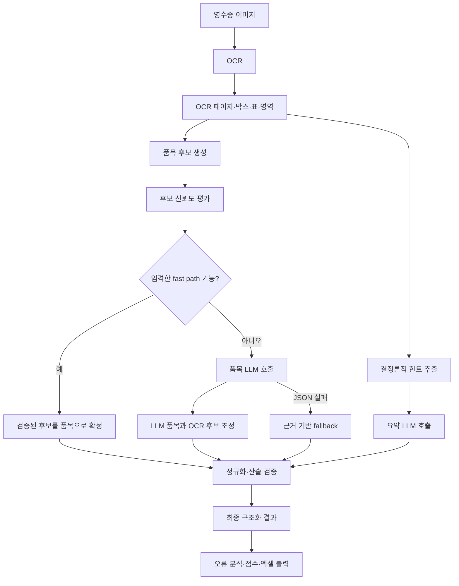

# 재무 영수증 인식 파이프라인

이 문서는 현재 `ocr-web-app`의 영수증 인식·구조화·평가 흐름을 개발자와 운영 담당자가 빠르게 이해할 수 있도록 정리한 문서다.

## 1. 목표

영수증 OCR 결과를 재무 처리에 사용할 수 있는 구조화 JSON으로 변환한다.

주요 출력 필드는 다음과 같다.

- 문서 유형 및 비용 카테고리
- 상호와 거래일자
- 공급가액, 부가세, 할인액, 최종 결제액
- 결제수단과 카드번호
- 품목명, 수량, 단가, 품목 금액
- 총 품목 수와 총수량
- 추출 근거, 검증 결과, 오류 진단

## 2. 전체 흐름



핵심 원칙은 **OCR와 코드가 증명할 수 있는 값은 코드가 결정하고, 애매한 의미 선택만 LLM에 맡기는 것**이다.

## 3. OCR 입력 구조

OCR 결과는 단순 문자열뿐 아니라 다음 정보를 포함할 수 있다.

```json
{
  "page": 1,
  "text": "전체 OCR 문자열",
  "items": [
    {
      "text": "OCR 박스 문자열",
      "bbox": [[x1, y1], [x2, y2]],
      "confidence": 0.98
    }
  ],
  "tables": [
    {
      "columns": ["name", "unit_price", "quantity", "amount"],
      "rows": []
    }
  ],
  "regions": [
    {
      "type": "items",
      "bbox": [[x1, y1], [x2, y2]]
    }
  ]
}
```

표와 영역 정보가 정확하면 우선 사용한다. 표가 없거나 열이 무너지면 OCR 행과 좌표를 이용해 복구한다.

## 4. 결정론적 힌트

`_receipt_hints`는 LLM 호출 전에 다음 값을 보수적으로 추출한다.

- 거래일자
- 공급가액과 부가세
- 할인액
- 최종 결제액 후보
- 결제수단
- 문서 유형과 카테고리 힌트
- 영수증에 명시된 품목 수와 총수량
- 할인 전 금액과 최종 금액의 관계

금액은 라벨과 산술 관계를 우선한다.

```text
공급가액 + 부가세 ≈ 결제금액
할인 전 금액 - 할인액 ≈ 결제금액
단가 × 수량 ≈ 품목 금액
```

숫자 정규식은 OCR 줄을 넘어 전화번호·사업자번호와 금액을 결합하지 않도록 줄 단위로 제한한다.

## 5. 의미별 OCR 근거

OCR 행은 다음 의미 영역에 중복 배정될 수 있다.

- `issuer`: 판매자·발행자
- `business_info`: 사업자번호·대표자·주소
- `transaction`: 거래일시·판매번호·POS
- `items`: 실제 품목 근거
- `service_detail`: 교통·숙박·진료 등 서비스 상세
- `adjustments`: 할인·쿠폰·포인트
- `tax_summary`: 공급가액·부가세
- `settlement`: 합계·받을금액·결제금액
- `payment`: 카드·현금·승인 정보
- `auxiliary`: 안내문·URL·교환 및 환불 안내

한 행이 여러 역할을 가질 수 있지만, 정산·세금·결제 행은 품목으로 생성하지 않는 것이 원칙이다.

## 6. 품목 후보 생성

후보 생성 과정의 정보 손실을 막기 위해 `structured_evidence` 중간 표현을 함께 만든다.

- `rows`: 원본 line ID, bbox, 숫자, 복수 role hypothesis
- `item_blocks`: 품목별 원본 행, 블록 구조, 부모-자식 relation
- `non_item_blocks`: 정산·세금·결제 행을 품목과 분리한 블록
- `fields`: 값별 confidence, `observed/derived/inferred` provenance, 근거 row ID

영수증 전체의 `receipt_structure`는 혼합 여부를 나타내는 약한 힌트로만 사용하고,
실제 해석 규칙은 각 `item_block.structure`에 기록한다. 기존 candidate 계약은
fallback 및 하위 호환성을 위해 유지하며, LLM과 진단 trace에는 구조화 근거도 함께 전달한다.

품목 후보는 가능한 한 LLM 호출 전에 만든다.

주요 후보 출처는 다음과 같다.

| source | 설명 |
|---|---|
| `table` | OCR 표에서 추출한 품목 |
| `item_region` | 품목 영역의 OCR 박스를 행으로 재조립한 품목 |
| `discounted_item_block` | 정가 행과 다음 할인·옵션 행을 결합한 품목 |
| `single_amount_item_row` | 상품명과 금액만 명확한 단일 행 |
| `inline_arithmetic_fallback` | 무너진 행을 단가·수량·금액 산술로 복구한 품목 |
| `fuel_sale_block` | 분리된 주유량·리터당 단가·결제액을 복구한 주유 품목 |
| `semantic_service_inference` | 품목이 인쇄되지 않은 서비스 전표의 제한적 추론 품목 |

다음 행은 품목에서 제외한다.

- 합계, 소계, 공급가액, 부가세
- 할인, 쿠폰, 포인트, 캐시백
- 승인번호, 거래번호, 카드번호, 단말기번호
- HelpDesk, 고객센터, 금융결제원 안내
- URL, 교환·환불 안내, 영수증 하단 메타데이터

## 7. 후보 신뢰도

후보에는 `rel`과 `why`가 붙는다.

```text
rel=H: 높은 신뢰도
rel=M: 검토가 필요한 후보
rel=L: 거절 후보
```

`why` 코드는 다음 의미다.

| 코드 | 의미 |
|---|---|
| `T` | 표 근거 |
| `R` | 품목 영역 또는 행 복구 근거 |
| `F` | 주유 블록 근거 |
| `D` | 제한된 서비스 도메인 추론 |
| `A` | 산술 관계 일치 |
| `C` | 영수증 명시 품목 수와 일치 |
| `S` | 품목 합계와 영수증 총액 일치 |
| `E` | 기타 근거 |

후보가 높은 신뢰도를 얻으려면 이름·금액뿐 아니라 표/영역/산술/합계 같은 독립적인 근거가 필요하다.

## 8. 무너진 표의 범용 fallback

열이 합쳐져 다음처럼 OCR된 경우를 복구한다.

```text
보통휘발유(01)1,429 × 20.994 30,000
```

복구 조건은 다음과 같다.

1. `×`, `x`, `X`, `*` 중 하나가 명시되어 있다.
2. 상품명으로 볼 수 있는 문자 근거가 있다.
3. 단가·수량·금액 후보가 숫자로 확인된다.
4. `단가 × 수량`과 금액의 차이가 허용 오차 안이다.

복구 결과 예시는 다음과 같다.

```json
{
  "name_candidate": "보통휘발유",
  "quantity_candidate": 20.994,
  "unit_price_candidate": 1429,
  "amount_candidate": 30000,
  "candidate_type": "measured_quantity_item",
  "item_type": "MEASURED_QUANTITY",
  "source": "inline_arithmetic_fallback"
}
```

기존 표 후보가 정상일 때는 이 fallback이 기존 결과를 덮어쓰지 않는다. 같은 OCR 행에서 생성된 불완전 후보만 교체한다.

## 9. 품목 유형

내부 품목 유형은 품목의 의미와 검증 방법을 구분하는 데 사용한다.

### `COUNT_BASED`

개수 기반 상품이다.

```text
단가 × 개수 = 품목 금액
```

### `MEASURED_QUANTITY`

무게·부피·길이·사용량 기반 상품이다.

```text
단위당 가격 × 측정량 ≈ 품목 금액
```

주유, 정육, 농수산물, 원단, 케이블, 가스·충전 품목 등에 적용할 수 있다. 소수 수량은 개수로 반올림하지 않는다.

### `SERVICE`

실제 품목명이 인쇄되지 않은 서비스 결제다.

```json
{
  "name": "미용 서비스",
  "quantity": 1,
  "unit": "회",
  "unit_price": 140000,
  "total_amount": 140000,
  "item_type": "SERVICE",
  "inferred": true
}
```

서비스 품목은 다음 조건에서만 만든다.

1. 구체적인 상품 행이 없다.
2. 서비스 사업자 근거가 명확하다.
3. 최종 결제금액이 명확하다.
4. 일반 상품 판매 근거가 없다.

현재 제한적으로 택시, 골프장, 미용 서비스 등에 적용한다.

## 10. LLM 호출

기본 모델은 환경변수 `RECEIPTS_LLM_MODEL`로 설정한다.

현재 기본 처리에서는 최대 두 번 호출한다.

### 요약 호출

품목을 제외한 다음 정보를 추출한다.

- 문서 유형
- 비용 카테고리
- 상호
- 거래일자
- 공급가액·부가세·할인액·총액
- 결제수단·카드번호

출력 제한은 500 토큰이다.

### 품목 호출

품목 후보, 의미별 OCR 행, 후보별 파서 규칙을 사용해 품목 JSON을 만든다.

출력 제한은 후보 수에 따라 400~750 토큰이다.

공통 Ollama 설정은 다음과 같다.

```text
temperature: 0.05
num_ctx: 8192
keep_alive: 30m
```

## 11. fast path와 fallback

### 엄격한 fast path

다음 조건이 충분히 충족되면 품목 LLM 호출을 생략한다.

- 모든 후보가 높은 신뢰도다.
- 품목 수 또는 합계가 독립적으로 검증된다.
- 수량·단가·금액 산술이 맞는다.
- 후보에 불확실성이나 대체 가격이 없다.
- 정산·세금·메타데이터가 품목명에 섞이지 않았다.

### 품목 LLM 실패 fallback

JSON 파싱 실패나 호출 실패가 발생해도 검증된 후보는 버리지 않는다.

복구 가능한 예시는 다음과 같다.

- 품목 수와 OCR 후보 수가 일치
- 후보 합계와 영수증 총액이 일치
- 검증된 표 후보
- 명시적 곱셈 관계가 있는 단일 행
- 조건을 만족하는 단일 서비스 결제

실패와 실제 무품목 문서를 구분하기 위해 `items_call_status`, `items_failure_type`, `fallback_used`를 기록한다.

## 12. 무근거 LLM 품목 방지

LLM이 OCR에 없는 품목을 생성할 수 있으므로 후보와 결과를 다시 비교한다.

예를 들어 품목 없는 미용 전표에서 다음 출력은 거부 대상이다.

```json
{
  "name": "JT-330",
  "specification": "0.2L",
  "unit_price": 6990,
  "total_amount": 6990
}
```

판단 근거는 다음과 같다.

- `JT-330`은 HelpDesk 행의 메타데이터다.
- `0.2L`, `6990`은 OCR 근거가 없다.
- 품목 금액이 영수증 결제액과 맞지 않는다.
- 검증된 단일 서비스 후보와 충돌한다.

이 경우 검증된 `미용 서비스` 후보를 사용한다.

## 13. 비용 카테고리

현재 허용 카테고리는 13개다.

```text
취미/쇼핑
미용
도서
전자제품/문구
교통
주유/교통
미용/생활
식비
레저
전자제품
식비/주류
의료
문화
```

이전 식비 계열 값은 다음처럼 통합한다.

```text
식비/생활 → 식비
생활/식비 → 식비
식비/쇼핑 → 식비
```

`식비/주류`는 소주, 맥주, 와인, 위스키 등 명확한 주류 근거가 있을 때만 유지한다. 음식, 과자, 일반 음료, 무알코올 음료는 `식비`로 정규화한다.

## 14. 정규화와 검증

LLM 결과와 코드 후보를 조정한 뒤 다음 검증을 수행한다.

- 빈 품목명
- 수량 × 단가와 품목 금액 불일치
- 품목 합계와 영수증 총액 불일치
- 공급가액 + 부가세와 총액 불일치
- 할인 전 금액 - 할인액과 결제액 불일치
- OCR 후보와 최종 값의 충돌
- 품목 수와 총수량 불일치
- 허용되지 않은 카테고리

높은 신뢰도의 OCR 후보와 모델 값이 충돌하면 검증된 OCR 값을 보호한다. 단, 할인 구조가 있는 영수증은 정가·할인액·할인 후 금액의 역할을 함께 고려해야 한다.

## 15. 진단 데이터

주요 진단 데이터는 `pipeline_trace`에 저장된다.

```json
{
  "llm": {
    "summary_raw": {},
    "items_raw": {},
    "summary_response_text": "",
    "items_response_text": "",
    "items_call_status": "success",
    "items_failure_type": null
  },
  "item_candidates": [],
  "model_items": [],
  "resolved_items": [],
  "semantic_evidence": {},
  "deterministic_hints": {}
}
```

문제가 발생하면 다음 순서로 확인한다.

1. `ocr_text`에 정답 근거가 있는가?
2. `ocr_pages.items`의 박스와 신뢰도는 정상인가?
3. `item_candidates`에 실제 품목이 있는가?
4. 정산·세금·메타데이터가 후보로 들어왔는가?
5. `summary_raw`, `items_raw`는 근거를 따랐는가?
6. `resolved_items`에서 후처리가 값을 변경했는가?
7. `deterministic_hints`가 올바른 값을 덮어썼는가?
8. `item_validation`과 `error_analysis`가 원인을 올바르게 분류했는가?

## 16. 주요 오류 코드

| 오류 코드 | 의미 |
|---|---|
| `OCR_TEXT_MISSING` | OCR 원문에서 정답 근거를 찾지 못함 |
| `ITEM_CANDIDATE_SELECTION_ERROR` | 실제 품목이 누락되거나 비품목 행을 후보로 선택 |
| `VALUE_CANDIDATE_MISSING` | OCR 숫자가 구조화 후보로 전달되지 않음 |
| `LLM_CHANGED_CORRECT_CANDIDATE` | 올바른 후보를 LLM이 다른 값으로 변경 |
| `EXTRA_ITEM` | 정답과 매칭되지 않는 추가 품목 생성 |
| `ITEM_SUM_MISMATCH` | 품목 금액 합계와 결제액 불일치 |
| `CATEGORY_INFERENCE_ERROR` | 카테고리 근거는 있으나 잘못 분류 |
| `MERCHANT_DETAIL_DROPPED` | 상호 또는 지점 정보 일부 누락 |
| `VALIDATOR_CHANGED_CORRECT_VALUE` | 검증·정규화 단계가 맞는 값을 변경 |

오류 태그는 원인 추정치다. OCR에 근거가 있는데 후보 생성이 실패한 경우를 OCR 오류로 잘못 분류할 수 있으므로 원문과 trace를 함께 확인한다.

## 17. 주요 코드 위치

| 파일 | 역할 |
|---|---|
| `backend/app/services/finance_receipt_evidence.py` | 힌트, 의미별 근거, 프롬프트 공통 값 |
| `backend/app/services/finance_receipt_candidates.py` | 품목 후보 생성과 신뢰도 평가 |
| `backend/app/services/finance_receipt_items.py` | 품목 프롬프트, 후보 조정, 검증, fallback |
| `backend/app/services/finance_receipt_pipeline.py` | 요약·품목 LLM 호출과 전체 오케스트레이션 |
| `backend/app/constants/finance_taxonomy.py` | 문서 유형과 비용 카테고리 |
| `backend/app/services/finance_error_analysis_service.py` | 오류 원인 분석 |
| `backend/app/services/finance_evaluation_scoring.py` | 평가 정규화와 점수 계산 |
| `backend/app/services/finance_workbook_service.py` | 재무 엑셀 출력 |
| `backend/tests/test_finance_classification.py` | 영수증 추출·fallback 회귀 테스트 |
| `backend/tests/test_finance_taxonomy.py` | 카테고리 회귀 테스트 |

## 18. 모델과 코드의 책임 경계

### 코드가 담당할 것

- 날짜·금액 형식 정규화
- 표와 좌표 기반 행 재구성
- 합계·세금·할인·메타데이터 제외
- 명시적 산술 관계 계산
- 후보 신뢰도 평가
- JSON 실패 fallback
- 카테고리 별칭 통합
- 결과 검증과 근거 기록

### LLM이 담당할 것

- OCR가 손상된 품목명 해석
- 브랜드·상호·지점 정보 선택
- 부모 품목과 옵션 관계 판단
- 제한된 카테고리 중 의미적으로 적합한 값 선택
- 코드만으로 확정하기 어려운 다중 행 구조 해석

LLM에 계산·정규식·명백한 제외 규칙까지 맡기면 4B 모델의 부담과 환각 가능성이 커진다.

## 19. 테스트

백엔드 전체 테스트는 백엔드 디렉터리에서 실행한다.

```powershell
cd backend
python -m pytest tests -q
```

영수증 파이프라인 변경 시 최소한 다음 테스트를 확인한다.

```powershell
python -m pytest tests/test_finance_classification.py tests/test_finance_taxonomy.py -q
```

현재 문서 작성 시점 기준 전체 테스트는 177개다.

## 20. 운영 시 주의사항

- 과거 평가 JSON은 당시 파이프라인 결과이므로 코드 수정 후 반드시 같은 데이터로 재평가한다.
- 모델 원응답과 최종 결과가 다르면 후처리 변경 여부를 먼저 확인한다.
- 품목 후보가 0개인 경우 모델 성능보다 후보 생성 실패 가능성을 먼저 본다.
- 정확한 총액을 모델이 반환했는데 최종값이 다르면 결정론적 힌트와 validator를 확인한다.
- 새로운 영수증 한 장의 문구를 직접 하드코딩하지 말고 표 구조·산술·문맥 조건으로 일반화한다.
- 추론으로 만든 서비스 품목은 반드시 `inferred=true`와 근거를 보존한다.
