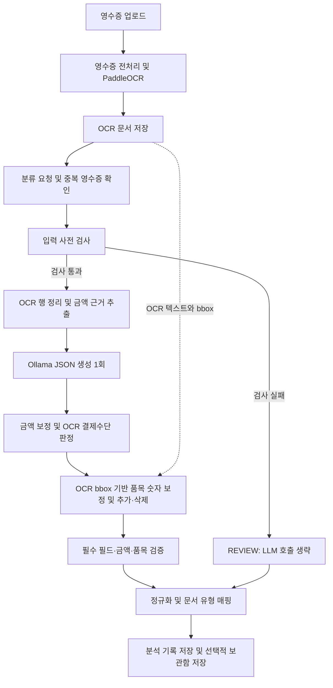

# Receipt Pipeline Simple v3

작성일: 2026-09-05. 현재 소스 코드와 프로젝트 `.env`를 기준으로 작성한 영수증 처리 문서다. 기존 `CURRENT-RECEIPT-PIPELINE.md`는 수정하지 않는다.

문서 유형 분류 변경: 현재 코드는 `receipt-simple-v3.2-document-classifier`다.
Gemma 1회와 기존 추출 프롬프트를 유지하고, 구조화 결과를 CPU TF-IDF + LogisticRegression에 전달한다.
분류 결과와 기존 검증을 합친 뒤 DB에 저장한다. 카테고리 매핑은 fallback으로 유지한다.
제공 합성 데이터 모델은 검증 기준 미달로 REVIEW 전용이며 자동 확정 threshold는 설정하지 않았다.
아래의 기존 "문서 유형 매핑" 설명에 대한 최신 내용은
[document classifier 분석·평가](receipt-document-classifier.md)를 따른다.

문서 이름의 v3와 코드의 프롬프트 버전은 별개다. 현재 프롬프트 버전은 `receipt-simple-v1.2-compact-category-ocr-payment`다.

현재 파이프라인 버전은 `receipt-simple-v3.1-post-llm-grounding`, 품목 후처리 버전은 `bbox-item-grounding-v3`다. 아래 설명은 품목 후처리와 카드번호 평가 제외까지 반영한다.

## 1. 목적과 변경 범위

정상 입력에 대해 Ollama를 한 번 호출하여 영수증을 구조화한다. 명확한 금액 근거와 결제수단은 코드에서 처리하고, 모델은 상호·날짜·금액·품목 추출 및 카테고리 판단을 담당한다.

이번 변경은 다음과 같다.

- 결제수단을 LLM 반환 요청에서 제외하고 OCR 근거로 `카드`, `현금`, `null` 중 하나를 결정한다.
- 중복된 금액 설명과 계산 예시를 줄인다. 금액 필드 자체는 여전히 LLM에 요청한다.
- 카테고리 이름뿐 아니라 공통 분류 정책을 프롬프트에 제공한다.
- 분류명이 OCR에 직접 없어도 상호·실제 구매 품목·서비스로 판단하도록 명시한다.
- 광고·환불 안내의 브랜드와 상품은 분류 근거에서 제외하도록 지시한다.
- Ollama 모델 로딩 시간을 기록한다.

모델 교체, 재학습, 추가 분류 LLM 호출, OCR 상한 축소는 이번 변경에 포함되지 않는다.

## 2. 전체 흐름



영수증 이미지 처리에서는 `processing_mode=receipt`로 영수증 전처리와 OCR을 수행한다. OCR 결과에는 텍스트 외에 좌표·표·영역 등의 정보가 포함될 수 있다. 현재 Simple 구조화 서비스는 `pages` 인자를 받지만, LLM 프롬프트 생성에는 OCR 텍스트만 사용한다. 이미지를 LLM에 직접 보내지 않는다.

일반 분류 라우트는 저장된 OCR 문서의 `extracted_text`를 읽는다. 프로세스 내부 `asyncio.Lock`으로 영수증 분류를 직렬화한다. 여러 서버 프로세스에 걸친 전역 잠금은 아니다. 라우트의 전체 시간 제한에는 이 잠금의 대기도 포함된다.

## 3. 사전 검사와 OCR 입력

다음 조건에서는 모델을 호출하지 않고 REVIEW 결과를 만든다.

| 조건 | 사유 |
|---|---|
| 공백 정리 후 텍스트 길이 40자 미만 | `OCR_TEXT_TOO_SHORT` |
| 금액 정규식에 맞는 숫자 없음 | `NO_MONEY_EVIDENCE` |
| 공백 정리 후 텍스트 길이 20,000자 초과 | `OCR_TEXT_TOO_DENSE` |

이 검사는 입력 품질에 대한 휴리스틱이며 실제 금액 존재 여부를 완벽하게 보장하지 않는다.

프롬프트용 OCR 처리:

1. 행별 공백을 정리하고 빈 행과 중복 행을 제거한다.
2. URL·고객센터·약관·일부 환불 안내 등 명백한 안내 행은 금액 패턴이 없을 때 제거한다.
3. `L001 | 내용` 형식으로 행 번호를 붙인다.
4. 렌더링된 OCR 부분은 최대 8,000자로 제한한다.
5. 초과 시 앞 25행, 뒤 35행, 금액 패턴을 가진 행을 우선 후보로 삼되 원래 순서대로 예산 안에서 선택한다.

금액 행과 마지막 행을 모두 보존한다는 보장은 없다. 한 행을 추가하면 상한을 넘는 시점에 선택을 종료한다. 8,000자는 전체 프롬프트가 아닌 OCR 부분의 상한이다.

## 4. LLM 입력과 출력

프롬프트는 다음 순서로 구성된다.

1. JSON 출력 형식과 필드 목록
2. 날짜·숫자·품목·금액·카테고리 규칙
3. 14개 카테고리와 `CATEGORY_CLASSIFICATION_POLICIES`의 기준
4. 규칙 기반 금액 근거 JSON
5. 정리한 OCR 행

`filename`은 함수 인자로 유지하지만 현재 프롬프트에는 넣지 않는다. 금액 근거의 `labels` 진단 객체도 프롬프트에서는 제외하며, 전체 근거는 진단 데이터에 유지한다. 광고 제외는 프롬프트 지시이며 모든 광고 행을 코드로 제거하는 구현은 아니다.

LLM에 요청하는 키:

```text
merchant, transaction_date, expense_category,
supply_amount, tax_amount, discount_amount, total_amount, items

items: name, quantity, unit_price, total_amount
```

결제수단·카드번호·문서 유형·총수량은 모델 요청 키가 아니다. 모델이 결제수단을 추가로 출력하더라도 최종값은 OCR 판정으로 대체한다.

카테고리 기준의 원본은 `backend/app/constants/finance_taxonomy.py`다. 예를 들어 식당 식사는 `외식/식사`, 카페·베이커리 음료와 디저트는 `카페/음료`, 마트·편의점 포장 식품 구매는 `식품/장보기`로 구분한다.

호출은 `/api/generate`, `format=json`, `stream=false`를 사용한다. JSON 형식 요청은 필드별 엄격한 JSON Schema 강제와는 다르다. 응답은 `json.loads()`로 파싱하고 객체인지 확인한다. 이 경로에는 재시도나 다른 모델로의 재호출이 없다.

## 5. 금액 근거와 보정

`_extract_amount_evidence()`는 주로 같은 OCR 행의 라벨과 숫자 연결을 사용해 공급액·과세액·면세액·세액·최종 결제액·할인액·절사액을 추출한다. 일부 금액과 부가세 조합 패턴도 지원한다.

`_reconcile_amounts()`의 주요 동작:

- 명시적 최종 결제액이 있으면 모델값보다 우선한다.
- 명시적 세액은 최종액 또는 공급액 관련 근거로 교차 확인될 때 적용한다.
- 명시적 공급액, 과세액과 면세액의 합, 면세 단독 근거 순으로 공급액을 결정한다.
- 면세 단독 근거와 조건이 맞으면 세액을 0으로 설정한다.
- 명시적 최종액·검증된 세액이 있고 구성 요소가 불완전하지 않을 때만 제한적으로 공급액을 역산한다.
- 변경 내역과 거부한 세액 근거는 `amount_resolution`에 기록한다.

금액 처리가 완전히 규칙 기반으로 전환된 것은 아니다. 명확한 근거로 덮어쓰지 않은 모델값은 남을 수 있다. 할인액은 근거로 추출해 전달하지만 이 보정 함수가 명시적 할인액을 무조건 최종값에 덮어쓰지는 않는다.

## 6. 결제수단과 카드번호

`_payment_from_ocr()`는 OCR 행의 공백을 정리한 뒤 실제 거래 근거를 찾는다.

| 근거 | 판정 |
|---|---|
| 신용카드·체크카드·신용승인·카드결제·카드번호·지원 카드사 표현 등 | 카드 후보 |
| 현금영수증·현금결제·현금수납·독립된 CASH 표현 등 | 현금 후보 |
| 카드 후보만 존재 | `카드` |
| 현금 후보만 존재 | `현금` |
| 양쪽 후보 존재 | `null` / `conflicting_evidence` |
| 근거 없음 | `null` / `missing_evidence` |

환불·반품·교환·혜택·일부 광고 및 발급 안내 표현을 포함하는 행과 0원 결제수단 행은 제외한다. `CASHIER`는 CASH 근거로 보지 않는다. `결제완료`, `일시불` 단독 표현이나 계좌이체는 카드·현금 확정 근거가 아니다.

결과와 근거 행은 `payment_method_evidence`에 기록한다. 정규식 기반이므로 OCR 오탈자·여러 줄로 분리된 근거·같은 행에 섞인 안내 문구로 인한 누락은 남을 수 있다. 결제수단이 null이라는 이유만으로 현재 검증에서 REVIEW를 강제하지는 않는다.

카드번호는 별도 `_ground_masked_card_number()`에서 처리한다. 명시적 카드번호 라벨, 마스킹 문자, 길이 조건을 만족하는 고유 후보 하나만 허용한다. 카드 결제임을 판정했어도 카드번호는 null일 수 있다.

현재 카드번호는 추출·저장을 유지하되 평가에서는 제외한다. `score_fields()`의 평가 필드 수·정답 수·완전 일치 판정과 오류 분석에서 비교하지 않으며, 이 점수에서 파생되는 OCR 영향 분석에도 포함되지 않는다. 결제수단은 계속 평가한다. 이미 저장된 과거 평가 결과는 자동으로 다시 계산되지 않는다.

## 6.1. LLM 호출 이후 품목 후처리

`ground_items()`는 JSON 파싱, 영수증 전체 금액 보정, 결제수단 판정 다음에 실행한다. 보정한 품목 목록으로 검증과 정규화를 수행하므로 품목 합계 검증과 총수량 계산에도 변경 결과가 반영된다.

품목 후보·bbox·표·confidence를 프롬프트에 추가하지 않는다. 후처리는 원본 OCR 텍스트와 페이지의 OCR box를 사용하며, 별도 LLM 호출이나 재시도는 없다. 현재 logical item row 구성은 bbox 기반이며 OCR `tables` 데이터를 직접 사용하는 구현은 아니다.

### OCR logical item row 구성과 매칭

1. 페이지 텍스트가 원본 OCR에 포함되는지 확인하고 유효한 bbox와 숫자·이름 후보를 모은다. 사용할 수 있는 레이아웃이 없으면 기존 품목을 유지한다.
2. box 높이와 세로 위치로 같은 행 후보를 묶고, 상품명 왼쪽·숫자 오른쪽 관계와 인접 숫자 행의 유일성을 확인한다. 분리된 이름 조각은 동일 숫자 행에 연결될 때 하나의 logical row로 합친다.
3. 상품명 유사도와 위치로 숫자 행을 찾는다. 여러 위치의 동일·유사 이름이나 여러 숫자 행이 경쟁하면 추측하지 않는다. `500m1`/`500ml` 같은 용량 접미사 혼동은 매칭할 때만 정규화하며 출력 품목명은 바꾸지 않는다.

단순 box 개수나 raw line 개수를 품목 수로 사용하지 않는다. 기존 품목과 느슨하게라도 관련된 logical row는 누락 추가 후보에서 제외하여 중복 생성을 억제한다.

### 숫자 교정

현재 `quantity × unit_price`와 `total_amount` 차이가 1 이하이고 값이 유효하면 유지한다. 산술적으로 정상이라는 이유만으로 정답이라고 판단하는 것은 아니지만, 이 후처리에서는 해당 숫자를 덮어쓰지 않는다.

산술 관계가 깨졌거나 값이 누락되면 이름에 연결된 같은 행 또는 가까운 숫자 행을 탐색한다. 명시적 수량 단위, 표 머리글의 열 위치, 관측 숫자 조합의 산술 관계를 사용한다. 후보가 유일하고 보정 후 세 값의 산술 관계도 검증될 때만 변경한다. 일부 열만 확인되는 경우에도 기존 나머지 값과 합쳐 관계가 성립해야 한다. 나눗셈으로 관측되지 않은 단가를 만들어 넣지는 않는다.

낮은 OCR 신뢰도, 할인·요약 행, 음수·복잡한 숫자 조합, 여러 품목의 동일 숫자 행 공유 등은 교정을 보류한다. 실제 예로 `receipt_030.jpg`의 `수량 9 / 단가 29,700 / 금액 29,700`은 OCR의 `9 / 3,300 / 29,700`으로 교정됐다.

### 과잉 품목 삭제와 누락 추가

추가와 삭제는 전체 품목 수 대소 비교에 묶이지 않고 각각 검사한다. 따라서 실제 품목 누락과 소계 오인이 동시에 발생해 총 개수가 같아도 처리할 수 있다.

- **삭제:** 어떤 logical row와도 이름이 관련되지 않고, 품목명이 엄격한 합계·소계·세금·할인·결제 등 요약 라벨에 해당하며, OCR에서도 같은 라벨과 숫자가 같은 행에 높은 신뢰도로 확인될 때 제거한다. 이름이 단순히 안 보이거나 가격이 다르다는 이유만으로 삭제하지 않는다. 현재 삭제 규칙은 이 좁은 요약 라벨 확인 방식이다.
- **추가:** 기존 품목과 관련되지 않은 logical row에 높은 신뢰도의 이름과 숫자가 있고, 상품명·수량·단가·금액 머리글이 모두 있으며, 유일한 산술 조합과 표 내부 위치가 확인될 때만 추가한다. 요약 행 뒤의 후보나 근거가 약한 후보는 제외한다. 단가 없는 일반 영수증 등은 누락이 있어도 추가되지 않을 수 있다.

### 보정 로그

결과는 `item_grounding`에 기록한다. 품목별 `items`에는 `original_item`, 가능한 경우 `matched_ocr_row`, `corrected_item`, `action`(`kept` / `corrected` / `removed` / `added`), `reason`, `confidence`가 들어간다. 숫자 변경은 `changes`로도 확인할 수 있다. confidence는 규칙에 따른 점수이며 정답 확률이 아니다.

전체 진단에는 `changed_items`, `added_items`, `removed_items`, `logical_row_count`, `before_count`, `after_count`, `elapsed_ms`를 기록한다. 입력이나 레이아웃을 사용할 수 없어 조기 반환한 경우에는 일부 항목과 품목별 로그가 없을 수 있다.

## 7. 검증과 정규화

`_simple_validation()`은 다음을 검사한다.

- 필수값: 상호, 거래일, 총금액, 카테고리
- 날짜 정규화와 카테고리 허용값·별칭 정규화
- 총금액이 OCR 숫자 근거에 존재하는지
- 공급액·세액 라벨이 있는데 값이 해소되지 않았는지
- 공급액 + 세액과 총금액의 관계, 할인 전 세금 요약 가능성: 허용 오차 10원
- 품목 합계와 최종액 또는 할인 반영 최종액의 관계: 허용 오차 10원
- 품목 수량 × 단가와 품목 금액의 차이: 1원 초과 시 비차단 경고

차단 사유가 있으면 `automation_validation.decision=REVIEW`, 없으면 `PASS`다. 품목 산술 경고만으로 REVIEW가 되지는 않는다. 빈 품목 목록과 일부 금액 누락도 조건에 따라 PASS일 수 있다. PASS는 정답 데이터와의 일치 보장이 아니다.

허용된 카테고리를 잘못 선택해도 일반적으로 그대로 남는다. 일부 과거 분류명만 OCR 근거로 세분화하며, 모델의 null 카테고리를 자동 분류하는 일반 규칙은 없다.

정규화에서는 카테고리를 문서 유형으로 매핑하고, 모든 품목 수량이 있을 때 총수량을 계산한다. 품목은 최대 50개를 정리한다. `needs_review`와 `review_reasons`는 검증 결과를 따른다. 저장용 최상위 `status`는 별도로 `REVIEW`로 설정된다. 또한 최상위 `total_amount`는 값이 없으면 0이 될 수 있으므로 원래 누락 상태는 `structured_data`와 검증 결과를 함께 확인한다.

## 8. 저장과 실패 처리

일반 분류 라우트는 OCR 지문·영수증 식별 키 등으로 기존 기록을 확인한다. 중복이어도 현재 모델로 새 분석 기록을 생성하며, 중복 연결 정보를 저장한다. 보관함 저장을 요청했더라도 중복이면 새 보관함 카드는 생성하지 않는다.

모델 호출·JSON 파싱 등이 실패하면 일반 분류 래퍼는 `LLM_CALL_FAILED`와 예외 종류를 담은 REVIEW 결과를 만든다. `_model_name=rules-fallback`은 실패 결과의 표식이며 다른 모델 호출이나 완전한 규칙 기반 재추출을 의미하지 않는다. 라우트 전체 시간 제한 초과는 HTTP 504로 처리한다.

## 9. 실행 설정과 시간 측정

작성 시점의 파일 설정이며 실행 중인 컨테이너 환경과 같다는 보장은 없다.

| 항목 | 값 |
|---|---|
| `RECEIPTS_LLM_MODEL` | `gemma3:4b-receipt-v3` |
| `RECEIPTS_LLM_KEEP_ALIVE` | `0s` |
| `RECEIPTS_LLM_NUM_CTX` | 4096 |
| `RECEIPTS_LLM_TIMEOUT_SECONDS` | 600 |
| `RECEIPTS_CLASSIFICATION_BUDGET_SECONDS` | 630 |
| `num_predict` | 800 |
| `temperature` | 0.05 |
| `repeat_penalty` | 1.08 |

`llm_trace`에는 모델·프롬프트 버전·호출 횟수·상태·입출력 문자 수·호출 시간을 기록한다.

| Ollama 기록 | 의미 |
|---|---|
| `load_duration_ms` | 모델 로딩 시간 |
| `prompt_eval_duration_ms` / `prompt_eval_count` | 입력 처리 시간·토큰 수 |
| `eval_duration_ms` / `eval_count` | 출력 생성 시간·토큰 수 |
| `total_duration_ms` | Ollama 측 합계 시간 |
| `done_reason` | 생성 종료 이유 |

Ollama 시간은 나노초에서 밀리초로 변환한다. 메트릭이 없는 응답에서는 빈 딕셔너리가 된다. `llm_trace.latency_ms`는 생성 호출의 실측 시간이며 OCR·저장·분류 잠금 대기를 포함한 전체 시간은 아니다.

`response_text`가 LLM 원문 응답이다. `raw_output`은 이름과 달리 금액 보정·결제수단 판정·품목 후처리·검증 이후의 스냅샷이다. 모델 오류와 후처리 오류를 구분할 때는 원문과 `item_grounding`을 함께 확인한다.

## 10. CPU/GPU를 고정한 비교

프로젝트 루트에서 CPU 구성으로 시작한다.

```powershell
docker compose -f docker-compose.yml -f docker-compose.override.yml up -d
```

기존 GPU 구성에서 전환할 때는 같은 명령에 `--force-recreate`를 붙인다. GPU 구성은 `-f docker-compose.gpu.yml`도 지정한다. 기존 컨테이너를 단순히 시작하는 것만으로 생성 당시 GPU 설정이 바뀌지는 않는다.

추론 중 확인 명령:

```powershell
docker exec ocr-ollama ollama ps
```

CPU 비교에서는 `PROCESSOR=100% CPU`인지 확인한다. 유휴 상태, 특히 KEEP_ALIVE가 0s일 때 목록이 비어 있는 것은 이상이 아니다.

모델·OCR 원문·프롬프트 버전·실행 장치·생성 설정·동시 부하·KEEP_ALIVE를 동일하게 유지한다. 모델 로딩을 포함한 측정과 모델 상주 후 측정은 구분한다. CPU 전용 실행 자체가 측정 정확도를 보장하지는 않는다.

## 11. 실시한 검증과 다음 평가

최신 변경 후 금융 관련 유닛 테스트 100개가 통과했다. 품목 후처리 테스트는 별도로 28개가 통과했다.

### 품목 후처리의 22건 재생 평가

저장된 OCR과 LLM 응답 22건을 추가 추론 없이 재사용했다. 비교 기준은 **저장된 LLM 응답의 정리된 items → 현재 품목 후처리 적용 결과**이며, 이전 후처리 버전과의 직접 비교나 전체 파이프라인 재추론 결과는 아니다.

| 오류 항목 | 보정 전 | 보정 후 |
|---|---:|---:|
| 품목 수가 다른 문서 | 9 | 9 |
| 총 물품 수량이 다른 문서 | 8 | 8 |
| 품목명 | 20 | 20 |
| quantity | 11 | 11 |
| unit_price | 31 | 30 |
| item total_amount | 31 | 31 |
| 초과 품목 수 | 14 | 14 |

숫자 필드 1건 개선, 악화 0건이다. 실제 22건에서는 추가·삭제 조건을 충족한 사례가 없어 각각 0건이었다. 과잉 품목 삭제와 누락 추가, 둘이 동시에 발생하는 경우는 별도 회귀 테스트로 검증했다. 현재 결과만으로 실제 데이터의 품목 수 오류가 개선됐다고 볼 수는 없다.

여기서 총수량은 품목 quantity 합을 비교한다. `EXTRA_ITEM`이라는 보고서 키는 기존 채점기의 `max(0, 예측 품목 수 - 정답 품목 수)`다. 할인·합계·환각 등을 따로 분류하는 오류 분석 서비스의 동명 태그 개수와 다르다. 품목명·숫자 오류는 기존 평가기의 품목 매칭 결과를 사용한다.

[상세 보고서](../reports/receipt_grounding_v3_replay.json)에는 문서별 보정 전후 품목, 보정 로그, 오류 수와 변화량이 있다. 프로젝트 루트에서 재생하는 명령은 다음과 같다.

```powershell
docker cp reports/receipt_grounding_replay_input.json ocr-backend:/tmp/grounding-replay-input.json
docker exec ocr-backend python scripts/evaluate_receipt_grounding.py --input /tmp/grounding-replay-input.json --output /tmp/grounding-v3.json
docker cp ocr-backend:/tmp/grounding-v3.json reports/receipt_grounding_v3_replay.json
docker exec ocr-backend python -m unittest discover -s tests -p 'test_receipt_item_grounding.py'
```

### 이전 결제수단·프롬프트 검증

기존 학습 모델 평가 JSON의 OCR 22건을 새 결제수단 코드에 재입력한 결과 21/22건이 일치했다. 원래 학습 모델 결과는 10/22건 일치했다. 남은 `test16.jpg`는 판정 규칙에서 충분한 근거를 찾지 못해 null이 됐다. 정답은 카드 18건·null 4건이며 현금 정답 사례를 포함하지 않는다.

동일 OCR을 사용한 변경 전후 평균 프롬프트 문자 수는 약 2,318자에서 1,959자로 줄었다. 약 15.5%의 문자 수 감소이며 토큰 수나 실제 시간의 감소율은 아니다.

상세 결과는 [오프라인 검증 결과](../reports/receipt_v12_offline_validation.json)를 참조한다. LLM을 재실행한 결과는 아니다. 새 프롬프트의 카테고리 정확도·처리 시간·전체 추출 정확도는 아직 측정하지 않았다.

다음 비교에서는 같은 22건을 재실행하고 카테고리·결제수단·금액·품목 정확도와 입력 처리·출력 생성·로딩 시간을 나누어 평가한다. 학습 모델은 이전 평가에서 22건 모두 카테고리를 원문부터 null로 출력했으므로 새 프롬프트로 개선되는지 확인해야 한다.

테스트 명령:

```powershell
docker exec ocr-backend python -m unittest discover -s tests -p 'test_finance_*.py'
```

## 12. 주요 구현 파일

- [Simple 구조화·검증](../backend/app/services/finance_receipt_simple.py)
- [분류 라우트·직렬화·저장](../backend/app/api/routes/finance.py)
- [Ollama 호출](../backend/app/api/routes/chatbot.py)
- [카테고리·문서 유형](../backend/app/constants/finance_taxonomy.py)
- [OCR 처리](../ocr/app/services/ocr/ocr_service.py)
- [분류 회귀 테스트](../backend/tests/test_finance_classification.py)
- [품목 bbox 후처리](../backend/app/services/receipt_item_grounding.py)
- [품목 후처리 회귀 테스트](../backend/tests/test_receipt_item_grounding.py)
- [저장 응답 재생 평가](../backend/scripts/evaluate_receipt_grounding.py)
- [평가 점수와 카드번호 제외](../backend/app/services/finance_evaluation_scoring.py)
- [오류 원인 분석](../backend/app/services/finance_error_analysis_service.py)
