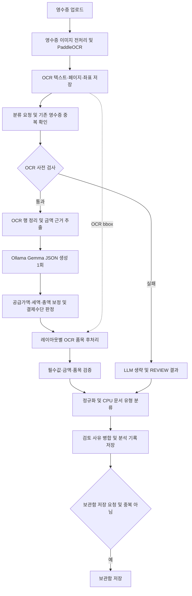

# Receipt Pipeline Simple v5

작성일: 2026-09-05. 현재 저장소 코드와 프로젝트 `.env`의 영수증 관련 설정을 기준으로 작성했다. 실행 중인 서버·컨테이너의 설정이나 정확도를 실측한 문서는 아니다.

현재 파이프라인은 **영수증 OCR → Gemma JSON 추출 1회 → OCR 근거 기반 후처리 → 검증 → CPU 문서 유형 분류 → 저장** 순서로 동작한다. LLM은 상호·날짜·금액·품목·지출 카테고리를 추출하고, 코드는 금액 근거 확인, 결제수단 판정, 품목 보정과 검토 여부를 처리한다.

## 1. 버전과 실행 설정

파일명의 **v5는 설명 문서 버전**이다. 모델, 프롬프트, 후처리의 실제 버전은 각각 다르다.

| 구분 | 현재 값 |
|---|---|
| 공통 파이프라인 메타데이터 | `v2.5` (`finance_pipeline.py`) |
| 영수증 추출 파이프라인 | `receipt-simple-v3.2-document-classifier` |
| 프롬프트 | `receipt-simple-v1.3-compact-category-decision-rules` |
| 품목 후처리 | `bbox-item-grounding-v4-header-table` |
| `.env`의 추출 모델 | `gemma3:4b-receipt-v4` |
| Modelfile 구성 | `gemma3:4b-base` + `gemma3-4b-receipt-v4-lora-f16.gguf` |
| 문서 분류 특징 버전 | `structured-receipt-v1` |
| LLM 컨텍스트 / 최대 생성 토큰 | `4096` / `800` |
| temperature / repeat_penalty | `0.05` / `1.08` |
| keep_alive | `0s` |
| LLM 요청 제한 / 분류 대기·추출 제한 | `600초` / `630초` |

모델 이름과 Modelfile은 파일 설정을 설명한다. 실제 Ollama에 등록된 모델의 내용까지 확인한 것은 아니다.

## 2. 전체 흐름



정상 추출은 LLM을 한 번 호출한다. 문서 유형 분류나 품목 보정 때문에 LLM을 추가 호출하지 않는다. 현재 경로는 OCR 텍스트를 LLM에 전달하며 이미지·bbox·표 데이터를 프롬프트에 넣지 않는다.

## 3. 업로드와 OCR

프런트엔드는 `/ocr/upload?processing_mode=receipt`로 업로드하고, 이후 `/finance/records/classify`에 `document_id`를 전달한다. 백엔드는 업로드 파일을 검증하고 OCR 서비스에 전달한 뒤, 원본 파일과 OCR 페이지 결과를 Supabase 저장 서비스로 저장한다.

영수증 이미지의 전처리 옵션에는 원근 보정, 기울기 보정, 영역 자르기, 확대, 조명 보정, 대비 향상, 글자 획 연결, 선명화가 포함된다. 조건에 맞는 변환을 적용하고 `applied_steps`에 기록한다. 이 설명은 이미지 입력 경로 기준이며 다른 파일 형식에는 별도 처리 분기가 있다.

PaddleOCR 결과에는 텍스트, bbox, 인식 점수와 표·영역 정보가 포함될 수 있다. 이미지 전처리 후 얻은 bbox는 원본 이미지 좌표로 변환한다. 분류 시 저장된 `extracted_text`와 `bounding_boxes`를 읽고, bbox는 LLM 응답 이후 품목 후처리에 사용한다.

## 4. LLM 호출 전 검사와 프롬프트

| 사전 검사 조건 | 결과 코드 |
|---|---|
| 공백 정리 후 40자 미만 | `OCR_TEXT_TOO_SHORT` |
| 금액 정규식에 맞는 숫자가 없음 | `NO_MONEY_EVIDENCE` |
| 공백 정리 후 20,000자 초과 | `OCR_TEXT_TOO_DENSE` |

이 조건에 해당하면 LLM 호출 없이 REVIEW 결과를 만든다. OCR 텍스트 자체가 비어 있으면 라우터에서 HTTP 422를 반환한다. 금액 정규식 검사는 입력 검사이며, 숫자가 실제 결제금액이라는 보장은 아니다.

프롬프트 준비 과정은 다음과 같다.

1. OCR 행의 공백을 정리하고 빈 행과 중복 행을 제거한다.
2. URL·고객센터·약관 등 명확한 안내 행은 금액 패턴이 없을 때 제거한다.
3. `L001 | 내용` 형태로 행 번호를 붙인다.
4. OCR 부분을 최대 8,000자로 제한한다. 초과하면 앞 25행, 뒤 35행, 금액 포함 행을 후보로 삼아 원래 순서대로 예산 안에서 선택한다. 모든 금액 행이나 마지막 행의 보존을 보장하지는 않는다.
5. 출력 필드, 추출 규칙, 14개 카테고리 기준, 규칙 기반 금액 근거와 OCR 행을 합쳐 프롬프트를 만든다.

LLM 출력 필드는 다음과 같다.

```text
merchant, transaction_date, expense_category,
supply_amount, tax_amount, discount_amount, total_amount, items

items: name, quantity, unit_price, total_amount
```

날짜는 `YYYY-MM-DD`, 금액과 수량은 숫자를 요청한다. 추출 근거가 없으면 `null`, 품목 근거가 없으면 `items=[]`를 요청한다. 할인·쿠폰·소계·세금·결제 행은 품목에서 제외하고 유상 쇼핑백·포장비·배달비는 포함한다.

카테고리는 실제 품목·서비스를 상호명보다 우선하고, 장소보다 거래 대상의 성격을 우선해 가장 구체적인 하나를 선택하도록 지시한다. 허용값은 외식/식사, 카페/음료, 식품/장보기, 생활용품, 의류/패션, 취미/선물, 미용/뷰티, 도서, 전자제품/문구, 대중교통, 주유/차량, 의료, 문화, 레저/스포츠이다.

Ollama `/api/generate`에 `format=json`, `stream=false`로 요청한다. 응답은 `json.loads()`로 파싱하고 객체인지 확인한다. 이 요청은 필드별 JSON Schema 강제와는 다르며 실패 시 재시도나 다른 모델 호출은 없다.

## 5. 금액과 결제수단 후처리

### 공급가액·세액·총액

`_reconcile_amounts()`는 **OCR 명시값 → 과세·면세 구성 → 조건부 산술 계산** 순서로 처리한다. 공급가액과 세액은 우선 OCR 근거로 다시 설정하므로, 근거 없는 LLM 값을 그대로 유지하지 않는다.

- 명시된 최종 결제금액이 있으면 총액에 반영한다. 최종 결제 구간과 할인 전 요약을 구분하는 문맥도 추출한다.
- 공급가액·세액 명시값을 보존하고, 구성 근거가 충분하면 과세 공급가액과 면세액을 합산한다.
- 총액이 확인되고 과세 거래 근거가 있으며 충돌·불완전한 구성·추가 세금·할인 과세표준 불확실성이 없는 경우에 제한적으로 계산한다. 명시 세액이 있으면 `총액 - 세액`, 세액이 없고 추가 조건을 충족하면 `round(총액 / 11)`을 사용한다.
- 명확한 면세 거래는 조건을 충족할 때 공급가액을 총액, 세액을 0으로 채운다. 카테고리만으로 면세를 확정하지 않는다.
- 혼합 과세·면세 거래의 총액 전체에 1/11 계산을 적용하지 않는다. 판단이 불가능한 금액은 `null`로 남기고 검토 사유를 전달한다.

`amount_resolution`에 과세 판단(`tax_treatment`), 공급가액·세액 출처, 변경 목록과 검토 사유를 남긴다. 명시값을 보존했더라도 합계 충돌이나 할인 기준 불확실성 때문에 REVIEW가 될 수 있다. 세부 구현 설명은 [금액 후처리 정책](receipt-tax-amount-policy.md)을 참고한다.

### 결제수단·카드번호

결제수단은 LLM 요청 필드에서 제외하며 OCR 거래 근거로 `카드`, `현금`, `null` 중 하나를 선택한다. 두 수단의 근거가 동시에 있거나 근거가 없으면 `null`이다. 환불·혜택·발급 안내 및 0원 결제수단 행 등을 제외한다. 근거는 `payment_method_evidence`에 저장한다.

카드번호는 명시적인 카드번호 라벨, 마스킹 문자, 12~19자리 슬롯 등의 조건을 만족하는 고유 후보가 하나일 때만 채운다. 결제수단이 카드여도 카드번호는 `null`일 수 있다. 카드번호 추출·저장은 유지하지만 현재 평가 점수에서는 제외한다.

## 6. 레이아웃에 따른 품목 후처리

`ground_items()`는 원본 OCR 텍스트와 bbox로 품목 행과 열 구조를 구성하고 LLM의 `items`를 직접 보정한다. OCR 서비스의 표 결과를 그대로 정답 품목으로 채택하는 방식은 아니다.

| 판단된 레이아웃 | 처리 |
|---|---|
| `COLUMN_TABLE` | 헤더와 열 위치로 품목 행을 구성하고 이름을 매칭해 관측 숫자로 보정 |
| `HIERARCHICAL`, `DISCOUNT_BLOCK` | LLM 품목 보존 |
| `UNKNOWN` | 판정 사유에 따라 보존 또는 보수적 숫자 보정 |
| 사용 가능한 bbox 없음 | 기존 품목 유지 |

열 기반 표에서는 이름 매칭과 행의 보정 가능성이 확인되면 수량·단가·금액을 교정한다. **LLM 숫자의 산술 관계가 맞더라도 표 근거로 교정할 수 있다.** 단가 열이 없는 3열 표에서는 관측 수량과 금액을 반영하되, 나눗셈으로 단가를 새로 만들지 않는다.

보수적 경로에서는 기존 `수량 × 단가 ≈ 금액` 관계가 1원 이내로 맞으면 유지한다. 누락이나 불일치가 있으면 이름, 가까운 숫자 행, 열 위치와 산술 관계가 충분히 명확할 때만 보정한다. 여러 품목이 같은 숫자 행을 공유하거나 매칭이 모호하면 변경하지 않는다.

품목 추가·삭제는 `COLUMN_TABLE` 경로에서만 검토한다. 누락 행의 강한 근거와 요약 행 오인 등 제한된 조건을 확인하며, 매칭되지 않았다는 이유만으로 삭제하지 않는다. 따라서 bbox 수나 OCR 줄 수가 최종 품목 수가 되지는 않는다.

`item_grounding`에는 레이아웃 유형·신뢰도·판정 사유, 헤더·열·논리 행, 품목별 매칭, 변경 전후 값, 추가·삭제 목록, 처리 시간이 남는다. 이 신뢰도는 규칙 기반 점수이며 정답 확률이 아니다.

## 7. 검증과 문서 유형 분류

### 추출 결과 검증

`_simple_validation()`은 상호·거래일·총액·카테고리의 필수값, 날짜 형식, 허용 카테고리, 총액의 OCR 숫자 근거, 공급가액·세액 처리 사유, 품목 합계 등을 확인한다.

- 금액 관계와 품목 합계의 허용 차이는 10원이다.
- 품목별 수량 × 단가와 품목 금액의 차이가 1원을 넘으면 비차단 경고를 기록한다. 이 경고만으로 REVIEW를 강제하지 않는다.
- 금액 후처리의 미해결·충돌 사유는 검증 사유에 병합된다.
- 검토 사유가 있으면 `automation_validation.decision=REVIEW`, 없으면 `PASS`이다.

정규화는 품목을 최대 50개로 정리하고, 모든 품목에 수량이 있으면 그 합을 `total_quantity`로 만든다. PASS는 정답과의 일치를 보장하는 정확도 지표가 아니다.

### CPU 문서 유형 분류

정규화 단계에서 `receipt_document_classifier.py`가 TF-IDF + LogisticRegression으로 문서 유형을 분류한다. 입력은 정규화된 카테고리, 상호, 품목명 및 프로필에 따라 거래 설명이다. OCR 원문을 직접 읽거나 LLM을 호출하지 않는다. 현재 추출 프롬프트는 거래 설명을 요청하지 않으므로 일반 추출에서는 설명이 없을 수 있다.

출력 후보는 `EXPENSE_REPORT`, `PURCHASE_REQUEST`, `TRAVEL_EXPENSE`, `WELFARE_BENEFIT`이다. 클래스별 확률과 임계값을 비교하고, 모델이 없거나 신뢰도가 부족하면 카테고리 매핑 등의 규칙을 fallback으로 사용한다. 카테고리를 다른 값으로 바꾸는 분류기는 아니다.

현재 동봉 분류기는 합성 데이터 검증 기준상 **REVIEW 전용**으로 문서화되어 있다. 자동 확정 임계값을 충족하지 못했으며 운영 검증도 완료되지 않았다. 따라서 추출 단계가 PASS여도 분류기의 검토 사유가 병합되어 최종 REVIEW가 될 수 있다. 상세 상태는 [문서 분류기 설명](receipt-document-classifier.md)과 [모델 README](../backend/data/document-classifier/README.md)를 참고한다.

## 8. 저장, 중복과 실패 처리

분류 라우터는 OCR 지문·영수증 식별 키와 기존 기록을 비교하고, 정규화 후에는 과거 형식의 식별 키도 확인한다. 중복이어도 현재 모델로 분석 기록을 새로 만들고 `duplicate_of_record_id`와 중복 진단을 저장한다. `save_to_archive`를 요청했고 중복이 아닐 때 보관함에도 저장한다.

저장되는 `structured_data`에는 추출 필드와 후처리·검증·분류 진단이 포함된다. `needs_review`는 최종 자동 검증 결과를 따르지만 **신규 기록의 최상위 업무 상태 `status`는 `REVIEW`로 설정**한다. 자동 검증 PASS와 업무 승인 상태는 별도이다. 최상위 `total_amount`는 누락 시 0이 될 수 있으므로 원래 누락 여부는 `structured_data`와 검증 사유를 함께 확인한다.

| 상황 | 처리 |
|---|---|
| 모델 이름 미설정 | HTTP 503 |
| OCR 텍스트 없음 | HTTP 422 |
| 사전 검사 실패 | 호출 수 0, REVIEW 결과 |
| 모델 호출·JSON 파싱 등 추출 경로 예외 | `LLM_CALL_FAILED` 및 예외 종류를 담은 REVIEW 결과 |
| 분류 잠금 대기와 추출이 630초 초과 | HTTP 504 |

분류 추출은 프로세스 내부 `asyncio.Lock`으로 직렬화한다. 여러 서버 프로세스에 걸친 전역 잠금은 아니다. 630초 제한은 잠금 대기와 추출 호출 구간을 감싸며 OCR 업로드, 이후 정규화·문서 분류·DB 저장까지 포함하는 전체 요청 시간 제한은 아니다.

예외 결과의 모델 이름 `rules-fallback`은 실패 결과를 표시한다. 다른 모델 호출이나 완전한 규칙 기반 재추출을 뜻하지 않는다.

## 9. 결과를 확인할 때 볼 진단

| 위치 | 확인할 내용 |
|---|---|
| `llm_trace.response_text` | 실제 LLM 원문 응답 |
| `llm_trace.raw_output` | 금액·결제·품목 후처리와 추출 검증 후 스냅샷. 이후 문서 분류·최종 정규화 전 결과 |
| `llm_trace.input_diagnostics` | OCR 행 수·길이·잘림 여부와 금액 근거 |
| `llm_trace.ollama` | 모델 로딩·입력 처리·출력 생성 시간과 토큰 수 등 |
| `amount_resolution` | 공급가액·세액 출처, 계산·충돌·미해결 사유 |
| `payment_method_evidence`, `card_number_evidence` | 결제수단·카드번호의 OCR 근거 |
| `item_grounding` | 레이아웃 판단과 품목별 보정 내역 |
| `automation_validation` | 최종 PASS/REVIEW, 사유, 비차단 경고 |
| `classification_decision` | 문서 유형 예측·선택, 확률·임계값, fallback과 검토 사유 |

`llm_trace.latency_ms`는 생성 호출 구간의 시간이다. OCR·잠금 대기·DB 저장을 포함한 전체 처리 시간으로 해석하지 않는다. 이 문서 작성 과정에서 모델 재추론이나 정확도 평가를 수행하지 않았으므로 과거 버전의 평가 수치를 현재 버전의 성능으로 제시하지 않는다.

## 10. 주요 구현 파일

- [영수증 추출·금액 보정·검증·정규화](../backend/app/services/finance_receipt_simple.py)
- [분류 요청·중복 판정·저장](../backend/app/api/routes/finance.py)
- [업로드와 OCR 결과 저장](../backend/app/api/routes/ocr.py)
- [OCR 처리](../ocr/app/services/ocr/ocr_service.py)
- [영수증 이미지 전처리](../ocr/app/services/receipt_preprocess_service.py)
- [품목 레이아웃 및 숫자 후처리](../backend/app/services/receipt_item_grounding.py)
- [문서 유형 분류](../backend/app/services/receipt_document_classifier.py)
- [카테고리 규칙과 문서 유형 매핑](../backend/app/constants/finance_taxonomy.py)
- [Ollama 요청](../backend/app/api/routes/chatbot.py)
- [모델 구성](../models/receipts/Modelfile)
