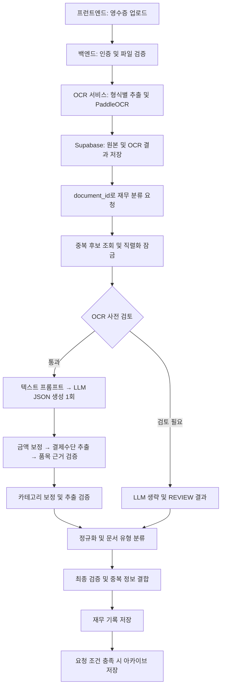

# 영수증 처리 파이프라인 현황

작성일: 2026-09-07. 현재 작업 공간의 소스 코드를 기준으로 작성한 별도 스냅샷이다. 기존 Markdown 문서는 수정하지 않았다. 실행 중인 서비스, 실제 배포 모델, DB 스키마 적용 상태 및 정확도는 이번 작업에서 검증하지 않았다. 환경 변수의 비밀 값은 포함하지 않는다.

## 1. 전체 구조

영수증 화면은 파일을 OCR API에 올리고, 반환된 `document_id`로 재무 분류 API를 호출한다. 분류 입력은 저장된 OCR 텍스트와 페이지 구조다.



## 2. 업로드와 OCR

- 화면 구현: [OCRPage.jsx](../frontend/src/pages/OCRPage.jsx), [FinanceEvaluationPage.jsx](../frontend/src/pages/FinanceEvaluationPage.jsx).
- 백엔드 진입점: `POST /api/v1/ocr/upload?processing_mode=receipt`.
- 백엔드는 사용자 인증과 업로드 파일 검증 후 OCR 서비스의 `/upload`에 파일과 처리 모드를 전달한다. OCR 호출 제한 시간은 300초다.
- API의 `processing_mode` 기본값은 `document`이며, 영수증 화면에서는 `receipt`를 명시한다.
- OCR 서비스는 파일 형식에 따라 텍스트 추출 또는 PaddleOCR 경로를 선택한다. 이미지 영수증 경로는 `preprocess_receipt_image()`를 사용하고, 일반 이미지 경로는 `preprocess_image()`를 사용한다. PDF 등은 별도 경로이므로 모든 입력에 이미지 전처리가 동일하게 적용되지는 않는다.
- 인식 결과는 페이지 텍스트, 박스 및 해당 경로에서 생성한 표·영역 정보로 구성된다.
- `save_ocr_document()`는 원본과 OCR 문서를 저장한다. 페이지 텍스트는 빈 줄 두 개로 연결한 `extracted_text`, 페이지 구조는 `bounding_boxes`에 저장되며 응답에 `document_id`가 붙는다.

구현: [OCR 백엔드 라우트](../backend/app/api/routes/ocr.py), [OCR 서비스](../ocr/app/services/ocr/ocr_service.py), [OCR 파서](../ocr/app/services/ocr/ocr_parser.py), [저장소 구현](../backend/app/services/supabase_document_finance_repository.py).

## 3. 분류 요청과 사전 검사

`POST /api/v1/finance/records/classify`는 `document_id`로 사용자의 저장된 문서를 읽는다. 이 단계에서 원본 OCR을 다시 실행하지 않는다.

1. `RECEIPTS_LLM_MODEL`이 비어 있으면 503, 저장된 OCR 텍스트가 없으면 422를 반환한다.
2. 사용자 재무 기록을 최대 1,000개 조회해 OCR 지문과 식별 키로 중복 후보를 찾는다. 같은 `document_id`는 이 중복 비교에서 제외한다.
3. 프로세스 내부 `asyncio.Lock`으로 운영 분류를 직렬화한다. 여러 프로세스 전체를 묶는 잠금은 아니다.
4. 잠금 대기를 포함한 분류 예산을 넘으면 504를 반환한다.
5. 공백을 정리한 OCR 텍스트가 40자 미만, 금액 패턴 없음, 20,000자 초과 중 하나에 해당하면 LLM 호출을 생략하고 검토 결과를 만든다.

사전 검토 사유는 각각 `OCR_TEXT_TOO_SHORT`, `NO_MONEY_EVIDENCE`, `OCR_TEXT_TOO_DENSE`다. 이 경우 trace에는 `call_count: 0`, `call_status: skipped_preflight_review`가 남는다.

구현: [finance.py](../backend/app/api/routes/finance.py), [finance_receipt_simple.py](../backend/app/services/finance_receipt_simple.py).

## 4. LLM 추출과 후처리 순서

정상 경로의 함수 호출 순서는 다음과 같다.

```text
_classify_receipt_with_model()
  → _preflight_review_reasons()
  → _simple_receipt_prompt()
  → _generate_receipt_json()
  → json.loads() 및 JSON 객체 검사
  → _reconcile_amounts()
  → _payment_from_ocr()
  → ground_items()
  → _simple_validation()
  → llm_trace 구성
  → _normalize()
```

LLM은 이미지가 아닌 OCR 텍스트를 받는다. 페이지 구조는 생성 이후 품목 검증에 사용한다. 프롬프트는 OCR 행, 규칙으로 추출한 금액 근거, 14개 지출 카테고리 정책을 포함한다. OCR 본문 예산은 8,000자이며 전체 프롬프트 길이와는 다르다.

LLM 반환 필드는 `merchant`, `transaction_date`, `expense_category`, `supply_amount`, `tax_amount`, `discount_amount`, `total_amount`, `items`다. 품목 필드는 `name`, `quantity`, `unit_price`, `total_amount`다. 정상 경로는 JSON 생성 1회이며 검증용 추가 LLM 호출은 없다.

금액 보정은 OCR의 공급가액·세액·총액 근거를 모델 출력과 대조한다. 산술 보정은 세금 유형과 충돌 여부 등 조건에 따라 수행되며, 근거가 불충분하면 검토 사유를 남긴다. 모든 영수증에 총액의 1/11을 세액으로 적용하는 방식은 아니다.

`ground_items()`는 품목과 OCR 텍스트·페이지 구조·총액을 대조해 보정과 진단을 수행한다. `_simple_validation()`은 필수값, 날짜·금액 형식, 금액 관계, 카테고리 및 품목 검증 사유를 결합한다.

운영용 `_classify_receipt()`는 추출 예외를 `LLM_CALL_FAILED` 및 `REVIEW` 결과로 바꾼다. 이때 모델 이름은 `rules-fallback`으로 기록되지만, 반환되는 주요 추출값은 비어 있으므로 성공한 규칙 추출 결과로 해석하면 안 된다.

## 5. 정규화, 문서 유형 및 상태

`_normalize()`는 추출 검증 결과를 별도로 복사해 보존하고 카테고리·품목을 정리한 뒤 `classify_document_type()`을 호출한다. 문서 유형은 지출 카테고리와 별도의 판단이다. 분류기는 규칙·카테고리 매핑과 분류기 아티팩트의 예측 및 신뢰도 기준을 사용한다.

이후 문서 분류 검토 사유를 최종 검증에 합치고, 품목 전체에 수량이 있을 때 총수량을 계산한다. 카드번호와 결제수단은 OCR 근거로 처리한다. 저장용 상호는 명시적 OCR 상호가 있으면 이를 우선한다.

| 필드 | 의미 |
|---|---|
| `extraction_validation` | 추출 단계의 검증 결과 |
| `classification_validation` | 문서 유형 분류의 판정과 사유 |
| `automation_validation` | 추출 및 문서 분류를 결합한 최종 판정 |
| `structured_data.needs_review` | 최종 판정이 `PASS`가 아닌지 여부 |
| 최상위 `status` | 신규 정규화 결과는 `REVIEW`로 저장 |

검증 `PASS`는 업무상 승인 완료를 뜻하지 않는다. 두 검증 단계를 모두 통과해야 최종 자동화 검증이 `PASS`가 되며, 승인·제출은 별도 API 흐름이다.

구현: [카테고리 정책](../backend/app/constants/finance_taxonomy.py), [문서 유형 분류기](../backend/app/services/receipt_document_classifier.py), [품목 근거 검증](../backend/app/services/receipt_item_grounding.py).

## 6. 중복과 저장

정규화 후 레거시 식별 키로도 중복을 비교한다. 중복 후보가 있어도 현재 모델로 분석하고, 새 결과에 `duplicate_of_record_id`와 `structured_data.duplicate_detection`을 붙인다. 중복 검사는 이전 결과를 돌려주는 캐시가 아니다.

`prompt_version`, `processed_at`, 영수증 지문·식별 키를 붙여 `save_finance_record()`를 호출한다. 요청의 `save_to_archive`가 참이고 중복이 아닐 때만 `save_receipt_archive()`를 호출한다. OCR 문서, 재무 분석 기록, 아카이브는 구분되는 저장 단계다.

## 7. 평가와 추적

평가 실행기는 저장된 OCR 텍스트·페이지와 지정 모델을 사용해 `_classify_receipt_with_model()`을 실행하고, `_normalize()` 후 `score_fields()`로 정답과 비교한다. 운영용 예외 래퍼를 그대로 호출하는 구조는 아니다.

| 추적 항목 | 확인 내용 |
|---|---|
| `llm_trace.response_text` | 모델의 원본 응답 문자열 |
| `llm_trace.raw_output` | 금액·품목·검증 후처리가 이미 적용된 객체 복사본 |
| `llm_trace.input_diagnostics` | OCR 입력 길이·잘림 및 금액 근거 |
| `amount_resolution` | 금액 출처, 보정 내역 및 세금 관련 진단 |
| `item_grounding` | 품목 근거와 보정 진단 |
| `classification_decision` | 문서 유형 선택 및 검토 근거 |
| `automation_validation` | 최종 검증과 단계별 판정 |

평가 코드의 `pure`라는 변수도 후처리가 적용된 결과다. 순수 모델 출력을 조사할 때는 `response_text`를 확인한다. 검증 통과율은 정답 대비 정확도와 구분해야 한다.

구현: [평가 API](../backend/app/api/routes/finance_evaluations.py), [평가 실행기](../backend/app/services/finance_evaluation_runner.py), [채점](../backend/app/services/finance_evaluation_scoring.py).

## 8. 코드 설정과 버전

아래 값은 코드 기본값 또는 상수다. 실제 실행 환경의 적용 값을 확인한 것은 아니다.

| 항목 | 값 |
|---|---|
| `RECEIPTS_LLM_MODEL` | 기본 빈 문자열, 환경 설정 필요 |
| `RECEIPTS_LLM_NUM_CTX` | 4096 |
| `RECEIPTS_LLM_KEEP_ALIVE` | `0s` |
| `RECEIPTS_LLM_TIMEOUT_SECONDS` | 600초 |
| `RECEIPTS_CLASSIFICATION_BUDGET_SECONDS` | 630초 |
| `RECEIPT_LLM_NUM_PREDICT` | 800 |
| `MAX_OCR_PROMPT_CHARS` | 8000 |
| `FINANCE_PROMPT_VERSION` | `receipt-simple-v1.4-category-context-refine` |
| `RECEIPT_PIPELINE_VERSION` | `receipt-simple-v3.2-document-classifier` |
| `FINANCE_PIPELINE_VERSION` | `v2.5`, 별도 메타데이터 |

설정 정의: [config.py](../backend/app/core/config.py), [finance_pipeline.py](../backend/app/services/finance_pipeline.py).

## 9. 이번 문서의 확인 범위

프런트엔드 호출부, OCR 업로드·처리 코드, 분류 서비스, 정규화 및 저장 호출, 평가 실행기와 버전 상수를 확인했다. 문서 작성 작업이므로 서비스 실행, 모델 추론, 회귀 테스트 및 정확도 재평가는 수행하지 않았다.
