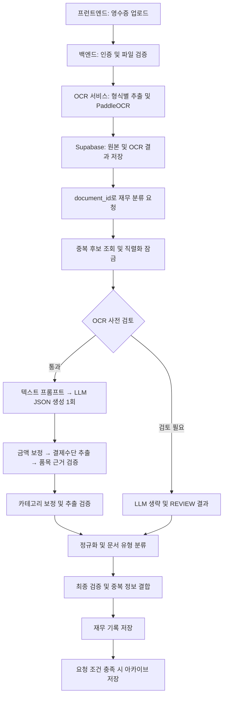

# 영수증 처리 파이프라인 현황

작성일: 2026-09-07. 현재 작업 공간의 소스 코드를 기준으로 작성한 별도 스냅샷이다. 기존 Markdown 문서는 수정하지 않았다. 실행 중인 서비스, 실제 배포 모델, DB 스키마 적용 상태 및 정확도는 이번 작업에서 검증하지 않았다. 환경 변수의 비밀 값은 포함하지 않는다.

## 현재 정책: 최종 사용자 확인 필수 (2026-09-07 변경)

이 정책은 아래 초기 스냅샷과 5.1~5.3절의 자동 통과·카테고리 검증 설명보다 우선한다. 현재 파이프라인 버전은 `receipt-simple-v3.4-user-confirmation`이다.

- 자동 처리·자동 승인 기능을 사용하지 않는다. 추출 검증 결과가 `PASS`여도 신규 기록은 `REVIEW`로 저장되고 사용자가 마지막에 확인한다.
- 문서 유형·지출 카테고리는 추천값이다. 신규 처리에서는 `classification_validation`과 `category_validation`을 생성하지 않으며, 분류 판정을 최종 승인 기준에 합치지 않는다.
- 평가와 모니터링에는 **추출 검증만** 표시·집계한다. 문서 분류·카테고리 검증·최종 자동처리 비율, 자동 승인 정확도와 품질 게이트는 제거했다.
- 기존 저장 형식과의 호환을 위해 `automation_validation` 키는 남지만, 정규화 후 그 판정은 항상 `USER_CONFIRM`이며 내부에 추출 검증 결과만 포함한다. 이 키는 자동 승인을 의미하지 않는다.
- 기존 사용자 확정 및 제출 API의 `CONFIRMED`·저장 완료 검사를 유지한다. 과거 DB 기록을 삭제하거나 일괄 수정하지는 않는다.

## 1. 전체 구조

영수증 화면은 파일을 OCR API에 올리고, 반환된 `document_id`로 재무 분류 API를 호출한다. 분류 입력은 저장된 OCR 텍스트와 페이지 구조다.



## 2. 업로드와 OCR

- 화면 구현: [OCRPage.jsx](../frontend/src/pages/OCRPage.jsx), [FinanceEvaluationPage.jsx](../frontend/src/pages/FinanceEvaluationPage.jsx).
- 백엔드 진입점: `POST /api/v1/ocr/upload?processing_mode=receipt`.
- 백엔드는 사용자 인증과 업로드 파일 검증 후 OCR 서비스의 `/upload`에 파일과 처리 모드를 전달한다. OCR 호출 제한 시간은 300초다.
- API의 `processing_mode` 기본값은 `document`이며, 영수증 화면에서는 `receipt`를 명시한다.
- OCR 서비스는 파일 형식에 따라 텍스트 추출 또는 PaddleOCR 경로를 선택한다. 이미지 영수증 경로는 `preprocess_receipt_image()`를 사용하고, 일반 이미지 경로는 `preprocess_image()`를 사용한다. PDF 등은 별도 경로이므로 모든 입력에 이미지 전처리가 동일하게 적용되지는 않는다.
- 인식 결과는 페이지 텍스트, 박스 및 해당 경로에서 생성한 표·영역 정보로 구성된다.
- `save_ocr_document()`는 원본과 OCR 문서를 저장한다. 페이지 텍스트는 빈 줄 두 개로 연결한 `extracted_text`, 페이지 구조는 `bounding_boxes`에 저장되며 응답에 `document_id`가 붙는다.

구현: [OCR 백엔드 라우트](../backend/app/api/routes/ocr.py), [OCR 서비스](../ocr/app/services/ocr/ocr_service.py), [OCR 파서](../ocr/app/services/ocr/ocr_parser.py), [저장소 구현](../backend/app/services/supabase_document_finance_repository.py).

## 3. 분류 요청과 사전 검사

`POST /api/v1/finance/records/classify`는 `document_id`로 사용자의 저장된 문서를 읽는다. 이 단계에서 원본 OCR을 다시 실행하지 않는다.

1. `RECEIPTS_LLM_MODEL`이 비어 있으면 503, 저장된 OCR 텍스트가 없으면 422를 반환한다.
2. 사용자 재무 기록을 최대 1,000개 조회해 OCR 지문과 식별 키로 중복 후보를 찾는다. 같은 `document_id`는 이 중복 비교에서 제외한다.
3. 프로세스 내부 `asyncio.Lock`으로 운영 분류를 직렬화한다. 여러 프로세스 전체를 묶는 잠금은 아니다.
4. 잠금 대기를 포함한 분류 예산을 넘으면 504를 반환한다.
5. 공백을 정리한 OCR 텍스트가 40자 미만, 금액 패턴 없음, 20,000자 초과 중 하나에 해당하면 LLM 호출을 생략하고 검토 결과를 만든다.

사전 검토 사유는 각각 `OCR_TEXT_TOO_SHORT`, `NO_MONEY_EVIDENCE`, `OCR_TEXT_TOO_DENSE`다. 이 경우 trace에는 `call_count: 0`, `call_status: skipped_preflight_review`가 남는다.

구현: [finance.py](../backend/app/api/routes/finance.py), [finance_receipt_simple.py](../backend/app/services/finance_receipt_simple.py).

## 4. LLM 추출과 후처리 순서

정상 경로의 함수 호출 순서는 다음과 같다.

```text
_classify_receipt_with_model()
  → _preflight_review_reasons()
  → _simple_receipt_prompt()
  → _generate_receipt_json()
  → json.loads() 및 JSON 객체 검사
  → _reconcile_amounts()
  → _payment_from_ocr()
  → ground_items()
  → _simple_validation()
  → llm_trace 구성
  → _normalize()
```

LLM은 이미지가 아닌 OCR 텍스트를 받는다. 페이지 구조는 생성 이후 품목 검증에 사용한다. 프롬프트는 OCR 행, 규칙으로 추출한 금액 근거, 14개 지출 카테고리 정책을 포함한다. OCR 본문 예산은 8,000자이며 전체 프롬프트 길이와는 다르다.

LLM 반환 필드는 `merchant`, `transaction_date`, `expense_category`, `supply_amount`, `tax_amount`, `discount_amount`, `total_amount`, `items`다. 품목 필드는 `name`, `quantity`, `unit_price`, `total_amount`다. 정상 경로는 JSON 생성 1회이며 검증용 추가 LLM 호출은 없다.

금액 보정은 OCR의 공급가액·세액·총액 근거를 모델 출력과 대조한다. 산술 보정은 세금 유형과 충돌 여부 등 조건에 따라 수행되며, 근거가 불충분하면 검토 사유를 남긴다. 모든 영수증에 총액의 1/11을 세액으로 적용하는 방식은 아니다.

`ground_items()`는 품목과 OCR 텍스트·페이지 구조·총액을 대조해 보정과 진단을 수행한다. `_simple_validation()`은 필수값, 날짜·금액 형식, 금액 관계, 카테고리 및 품목 검증 사유를 결합한다.

운영용 `_classify_receipt()`는 추출 예외를 `LLM_CALL_FAILED` 및 `REVIEW` 결과로 바꾼다. 이때 모델 이름은 `rules-fallback`으로 기록되지만, 반환되는 주요 추출값은 비어 있으므로 성공한 규칙 추출 결과로 해석하면 안 된다.

## 5. 정규화, 문서 유형 및 상태

`_normalize()`는 추출 검증 결과를 별도로 복사해 보존하고 카테고리·품목을 정리한 뒤 `classify_document_type()`을 호출한다. 문서 유형은 지출 카테고리와 별도의 판단이다. 분류기는 규칙·카테고리 매핑과 분류기 아티팩트의 예측 및 신뢰도 기준을 사용한다.

이후 문서 분류 검토 사유를 최종 검증에 합치고, 품목 전체에 수량이 있을 때 총수량을 계산한다. 카드번호와 결제수단은 OCR 근거로 처리한다. 저장용 상호는 명시적 OCR 상호가 있으면 이를 우선한다.

| 필드 | 의미 |
|---|---|
| `extraction_validation` | 추출 단계의 검증 결과 |
| `classification_validation` | 문서 유형 분류의 판정과 사유 |
| `automation_validation` | 추출 및 문서 분류를 결합한 최종 판정 |
| `structured_data.needs_review` | 최종 판정이 `PASS`가 아닌지 여부 |
| 최상위 `status` | 신규 정규화 결과는 `REVIEW`로 저장 |

검증 `PASS`는 업무상 승인 완료를 뜻하지 않는다. 두 검증 단계를 모두 통과해야 최종 자동화 검증이 `PASS`가 되며, 승인·제출은 별도 API 흐름이다.

구현: [카테고리 정책](../backend/app/constants/finance_taxonomy.py), [문서 유형 분류기](../backend/app/services/receipt_document_classifier.py), [품목 근거 검증](../backend/app/services/receipt_item_grounding.py).

### 5.1. 문서 분류를 자동 통과시키지 않는 이유

현재 작업 공간에 포함된 분류기는 **검토 전용(REVIEW-only)** 이다. 문서 유형 후보를 제시하는 것과 자동 처리할 만큼 검증되었다는 것은 별개다.

- 모델 README에는 어떤 문서 유형도 검증 정밀도와 표본 수 기준을 충족하지 못했다고 명시되어 있다. 유형별 자동 통과 임계값이 없거나 예측 확률이 임계값보다 낮으면 `DOCUMENT_CLASSIFIER_LOW_CONFIDENCE` 사유로 검토한다. 이 코드는 단순히 예측 확률이 낮을 때뿐 아니라, 해당 유형에 승인 가능한 임계값이 없을 때도 발생한다.
- 학습 스크립트는 모델에 `production_validated=False`를 저장한다. 분류기는 이 값이 거짓이면 `DOCUMENT_CLASSIFIER_SYNTHETIC_VALIDATION_ONLY`를 추가하므로, 예측 확률이 높고 다른 조건을 만족해도 `PASS`가 될 수 없다. 합성 데이터 평가를 실제 운영 검증으로 간주하지 않는 제한이다.
- 분류기 부재, 입력 특징 없음, 유효하지 않은 카테고리, 강한 문맥 규칙과 예측의 충돌, 추론 실패도 검토 사유다. 실제 건별 원인은 저장된 `classification_decision` 및 `classification_validation.reasons`로 확인해야 한다.

자동 통과의 근거가 부족한 이유는 입력 정보와 검증 범위에 있다. 현재 배포 후보는 비용 카테고리·가맹점·품목명을 사용한다. 같은 식당 영수증도 출장 식비, 직원 복지, 개인 식사일 수 있으므로 이 정보만으로 업무 목적을 확정하기 어렵다. 또한 모델의 높은 예측 확률은 실제 문서에서의 정답률을 보장하지 않는다. 실제 OCR 오류, 애매한 지출 목적, 다양한 가맹점이 포함된 독립적인 운영 데이터로 성능을 검증해야 한다.

따라서 통과율을 올리기 위해 임계값을 낮추거나 `production_validated`만 참으로 바꾸어서는 안 된다. 실제 업무 문서에 정답과 필요한 업무 맥락을 확보하고, 유형별 정밀도·검증 표본 수·오분류 사례를 확인한 뒤 자동 통과 범위를 결정해야 한다.

근거: [모델 README](../backend/data/document-classifier/README.md), [분류 판정 코드](../backend/app/services/receipt_document_classifier.py), [학습 및 임계값 선택 코드](../backend/scripts/train_receipt_document_classifier.py), [평가 보고서](../reports/document-classifier-evaluation.json). 실제 실행 서비스가 동일한 모델을 사용하는지는 별도 확인이 필요하다.

### 5.2. 화면의 문서 분류 0%를 읽는 방법

자동처리 검증 현황의 문서 분류 비율은 **분류 정확도가 아니라 자동 통과율**이다. 계산식은 `classification_validation.decision`이 `PASS`인 건수 / 해당 판정이 `PASS` 또는 `REVIEW`로 기록된 건수다. 단계별 판정이 없는 과거 결과는 미측정으로 제외한다.

예를 들어 `통과 0 / 측정 182건`은 182건 중 자동 통과한 건이 없다는 뜻이며, 182건의 문서 유형을 모두 틀렸다는 뜻은 아니다. 현재 검토 전용 설정은 이러한 0%를 설명하지만, 화면 수치만으로 182건 모두의 검토 사유가 같다고 단정할 수는 없다. ‘문서 분류’ 카드를 선택해 분류 검토 사유를 확인해야 하며, ‘추출 검증’ 카드에 표시되는 금액 불일치 등의 사유와 구분해야 한다.

추출 검증·문서 분류·최종 자동처리는 각각 판정이 기록된 결과를 분모로 사용하므로, 과거 결과에 단계별 판정이 없으면 측정 건수가 서로 다를 수 있다. 현재 설정을 변경해도 저장된 과거 판정이 자동으로 재계산되지는 않는다.

집계 구현: [평가 API의 `_monitoring_automation()`](../backend/app/api/routes/finance_evaluations.py).

### 5.3. 카테고리 제안과 검증 분리 (같은 날 추가 구현)

이 절은 위 최초 스냅샷의 카테고리 보정 흐름을 대체한다. 프롬프트 버전은 `receipt-simple-v1.5-category-evidence`, 파이프라인 버전은 `receipt-simple-v3.3-category-validation`이다.

LLM은 `expense_category_suggestion`과 `expense_category_evidence: [{"text": "OCR 한 행의 원문 인용"}]`를 반환한다. 카테고리 제안 때문에 금액·상호·품목을 바꾸지 않도록 지시한다. 이전 모델의 `expense_category` 출력도 후보로 받아들이지만, 근거가 없으면 사용자 확인 대상으로 처리한다.

`_simple_validation()`은 카테고리 검증을 제외한 추출 검증을 담당한다. `_normalize()`에서 `validate_category()`를 별도로 실행한다. 원문 인용이 OCR의 실제 행에 포함되는지 대조하고, 행 번호는 서버가 계산한다. 원래 제안, 별칭 정규화 값, OCR 문맥에 따른 별도 추천값, 근거 일치 결과를 `category_validation`에 보존한다. 문맥 추천값으로 카테고리나 금액·품목을 덮어쓰지 않는다. 기존 `expense_category` 필드에는 정규화된 제안값을 저장한다.

| 카테고리 판정 | 현재 동작 |
|---|---|
| `PASS` | 자동 통과 기준의 운영 검증이 완료된 범위를 위한 상태. 현재 허용 범위는 없으므로 자동 발급하지 않음 |
| `USER_CONFIRM` | 후보 없음, 근거 부족, 문맥상 다른 추천 또는 자동 통과 기준 검증 미완료 |
| `REVIEW` | 허용되지 않은 카테고리, 근거 형식 오류 또는 OCR에 없는 인용 |

인용 일치는 실제 구매 여부나 의미상 카테고리 적합성을 증명하지 않는다. 혼합 구매·광고 문구·업무 목적의 모호함을 모두 해결한 검증기로 간주하지 않으며, 이 때문에 원문 일치만으로 자동 통과시키지 않는다. 별도 문서 유형 분류기는 기존 검토 전용 동작을 유지한다.

최종 `automation_validation`은 추출·카테고리·문서 분류 판정을 결합한다. 우선순위는 `REVIEW > USER_CONFIRM > PASS`다. 따라서 문서 분류가 `REVIEW`인 현재 모델에서는 카테고리가 `USER_CONFIRM`이어도 최종 상태는 `REVIEW`다. 신규 레코드의 DB 업무 상태는 기존 `REVIEW`를 유지하며, 검증 상태를 DB 업무 상태에 직접 대입하지 않는다.

사용자가 수정·확인한 카테고리는 `category_confirmation`에 값·사용자·시각을 별도로 기록하고 원래 자동 검증 결과는 보존한다. 영수증 화면은 카테고리 검증 상태와 원문 근거를 표시한다. 모니터링·일괄 평가·JSON 통계에는 카테고리 단계를 추가하며, `USER_CONFIRM`도 측정 분모에 포함하고 별도 건수로 집계한다. 기존 기록에 새 검증 결과를 소급 생성하지는 않는다.

구현: [카테고리 검증기](../backend/app/services/receipt_category_validation.py).

출력량 제한 추가: 프롬프트 `receipt-simple-v1.6-bounded-category-evidence`는 카테고리 근거를 최대 2개, 각 `text`를 40자 이내의 연속된 OCR 원문으로 요청한다. 중복·설명·판단 과정은 제외한다. 후처리 `category-evidence-v2-bounded`는 최대 2개만 대조하고 개수·길이 초과를 `CATEGORY_EVIDENCE_LIMIT_EXCEEDED` 및 `REVIEW`로 기록한다. 긴 인용을 잘라서 유효한 근거로 인정하지 않으며 원래 응답은 추적용으로 보존한다. LLM 추가 호출이나 재시도는 없고 품목 출력 한도는 변경하지 않는다. 프롬프트 제한은 모델 생성 길이를 강제로 보장하지 않으며, 후처리 제한은 이미 생성한 토큰 비용을 줄이지 않는다. 실제 지연 개선 폭은 별도 측정이 필요하다.

## 6. 중복과 저장

정규화 후 레거시 식별 키로도 중복을 비교한다. 중복 후보가 있어도 현재 모델로 분석하고, 새 결과에 `duplicate_of_record_id`와 `structured_data.duplicate_detection`을 붙인다. 중복 검사는 이전 결과를 돌려주는 캐시가 아니다.

`prompt_version`, `processed_at`, 영수증 지문·식별 키를 붙여 `save_finance_record()`를 호출한다. 요청의 `save_to_archive`가 참이고 중복이 아닐 때만 `save_receipt_archive()`를 호출한다. OCR 문서, 재무 분석 기록, 아카이브는 구분되는 저장 단계다.

## 7. 평가와 추적

평가 실행기는 저장된 OCR 텍스트·페이지와 지정 모델을 사용해 `_classify_receipt_with_model()`을 실행하고, `_normalize()` 후 `score_fields()`로 정답과 비교한다. 운영용 예외 래퍼를 그대로 호출하는 구조는 아니다.

| 추적 항목 | 확인 내용 |
|---|---|
| `llm_trace.response_text` | 모델의 원본 응답 문자열 |
| `llm_trace.raw_output` | 금액·품목·검증 후처리가 이미 적용된 객체 복사본 |
| `llm_trace.input_diagnostics` | OCR 입력 길이·잘림 및 금액 근거 |
| `amount_resolution` | 금액 출처, 보정 내역 및 세금 관련 진단 |
| `item_grounding` | 품목 근거와 보정 진단 |
| `classification_decision` | 문서 유형 선택 및 검토 근거 |
| `automation_validation` | 최종 검증과 단계별 판정 |

평가 코드의 `pure`라는 변수도 후처리가 적용된 결과다. 순수 모델 출력을 조사할 때는 `response_text`를 확인한다. 검증 통과율은 정답 대비 정확도와 구분해야 한다.

구현: [평가 API](../backend/app/api/routes/finance_evaluations.py), [평가 실행기](../backend/app/services/finance_evaluation_runner.py), [채점](../backend/app/services/finance_evaluation_scoring.py).

## 8. 코드 설정과 버전

아래 값은 코드 기본값 또는 상수다. 실제 실행 환경의 적용 값을 확인한 것은 아니다.

| 항목 | 값 |
|---|---|
| `RECEIPTS_LLM_MODEL` | 기본 빈 문자열, 환경 설정 필요 |
| `RECEIPTS_LLM_NUM_CTX` | 4096 |
| `RECEIPTS_LLM_KEEP_ALIVE` | `0s` |
| `RECEIPTS_LLM_TIMEOUT_SECONDS` | 600초 |
| `RECEIPTS_CLASSIFICATION_BUDGET_SECONDS` | 630초 |
| `RECEIPT_LLM_NUM_PREDICT` | 800 |
| `MAX_OCR_PROMPT_CHARS` | 8000 |
| `FINANCE_PROMPT_VERSION` | `receipt-simple-v1.4-category-context-refine` |
| `RECEIPT_PIPELINE_VERSION` | `receipt-simple-v3.2-document-classifier` |
| `FINANCE_PIPELINE_VERSION` | `v2.5`, 별도 메타데이터 |

설정 정의: [config.py](../backend/app/core/config.py), [finance_pipeline.py](../backend/app/services/finance_pipeline.py).

## 9. 이번 문서의 확인 범위

프런트엔드 호출부, OCR 업로드·처리 코드, 분류 서비스, 정규화 및 저장 호출, 평가 실행기와 버전 상수를 확인했다. 문서 작성 작업이므로 서비스 실행, 모델 추론, 회귀 테스트 및 정확도 재평가는 수행하지 않았다.
