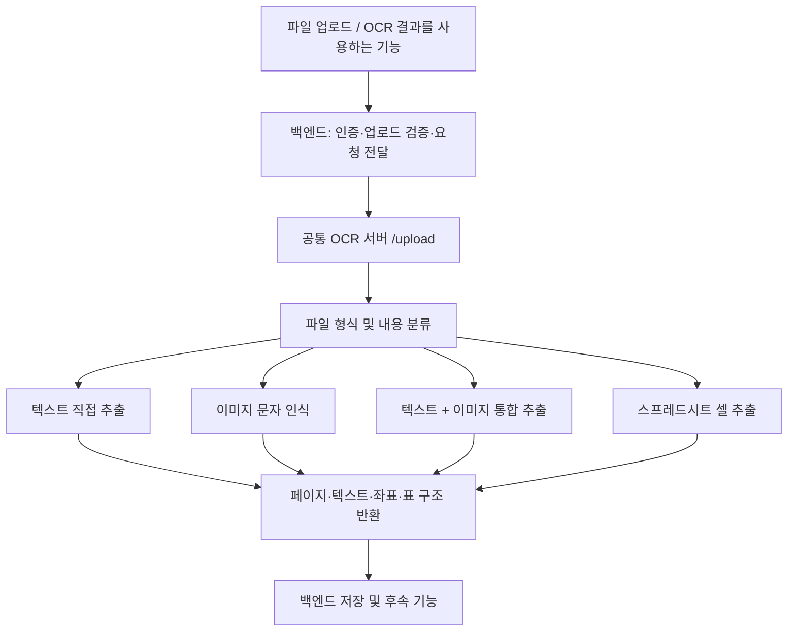

# 공통 OCR 및 문서 추출 모듈

이 폴더는 서비스의 여러 기능에서 함께 사용하는 **문서 인식·추출 서버**다. 이미지에서 문자를 인식하는 OCR뿐 아니라 PDF·DOCX의 텍스트와 이미지 추출, Excel 셀 읽기, 문서 표 복원, 미리보기용 데이터 제공을 담당한다. 입력 형식이 달라도 결과를 `OCRResponse → OCRPage → OCRItem` 구조로 반환하므로 후속 기능에서 같은 인터페이스로 사용할 수 있다.

기본 처리 모드는 일반 문서를 위한 `document`다. 영수증 처리는 `receipt` 모드에서 제공하는 특화 기능이며, 공통 모듈 전체의 용도를 영수증으로 제한하지 않는다. 아래 설명은 현재 코드의 구현을 기준으로 한다.

## 1. 시스템에서의 역할



공통 서버는 문서에 **어떤 글자가 있고 어디에 있는지**를 추출한다. 추출 결과는 문서 조회·검색 입력, RAG용 문서 입력, 개인정보 위치 표시, 회계 문서 분석 등의 기초 데이터로 활용할 수 있다. 검색·답변 생성, 개인정보 판별, 회계 항목 분류와 같은 업무 판단은 이 OCR 서버의 책임에 포함되지 않는다.

실제 연결 지점인 [백엔드 OCR 라우터](../backend/app/api/routes/ocr.py)는 `OCR_BASE_URL`로 이 서버를 호출한다. 해당 라우터에서 사용자 인증, 파일 검증, 결과 저장, `OCR`/`RAG` 업로드 출처 구분, 여러 이미지 묶음 처리, 저장 문서 조회 및 개인정보 박스 조회를 담당한다. 여러 이미지 묶음 처리는 백엔드가 각 이미지를 공통 서버에 전달한 뒤 결과를 합치는 방식이다.

## 2. 지원 파일과 추출 경로

| 입력 | 분류·처리 방식 | 결과 특징 |
| --- | --- | --- |
| JPG, JPEG, PNG, WEBP, BMP, TIF, TIFF | 이미지로 분류하여 전처리 후 PaddleOCR 실행 | 인식 텍스트, 신뢰도, 위치, 탐지된 표 |
| 텍스트 PDF | PyMuPDF로 텍스트 직접 추출 | 일반 문서 모드에서 단어 좌표, 표, 읽기 순서 처리 |
| 이미지 PDF | PDF 파일을 PaddleOCR에 전달 | 엔진의 페이지별 인식 결과; 일반 이미지 전처리 경로와 다름 |
| 텍스트·이미지 혼합 PDF | 텍스트 직접 추출 + 내부 이미지별 OCR | 이미지 OCR 좌표를 PDF 페이지 좌표로 변환하여 통합 |
| DOCX | LibreOffice로 PDF 변환 후 텍스트·이미지 추출 | 변환된 PDF 기준 페이지·좌표 유지 |
| TXT, MD, CSV | UTF-8로 직접 읽고 텍스트 정규화 | 하나의 논리 페이지와 줄별 가상 좌표; CSV도 일반 텍스트로 처리 |
| XLSX, XLSM | openpyxl로 셀 직접 추출 | 시트별 페이지, 시트 이름, 행 데이터, 셀 주소 |
| 그 밖의 확장자 | `unknown` | 현재 공통 서버는 빈 `pages` 반환 |

[file_classifier.py](app/services/file_classifier.py)는 확장자로 1차 분기하고, PDF·DOCX는 내부 텍스트와 이미지 존재 여부를 확인한다. 분류 값은 `text_only`, `image_only`, `text_and_image`, `spreadsheet`, `unknown`이다. PDF 분류는 파일 전체 기준이며, 페이지마다 별도의 분류 값을 반환하지 않는다. 확장자가 지원 목록에 있어도 손상된 파일이나 개별 이미지 인코딩의 처리가 보장되는 것은 아니다.

## 3. 공통 처리 과정

### 요청 수신과 경로 선택

[process_ocr](app/services/ocr/ocr_service.py)는 업로드 파일을 임시 파일로 저장하고, 분류 결과와 `processing_mode`에 따라 추출기를 선택한다. 추출이 끝나면 공통 응답을 생성하고 `finally`에서 업로드 임시 파일을 삭제한다. PDF 내부 이미지와 DOCX 변환에도 임시 파일·디렉터리를 사용한다.

### 일반 이미지 전처리

[preprocess_service.py](app/services/preprocess_service.py)의 기본 흐름은 다음과 같다.

1. OpenCV로 컬러 이미지를 읽는다.
2. 수평선의 각도를 이용해 작은 기울기를 보정한다.
3. 폭이 작은 이미지를 최대 2.5배까지 확대한다. 목표 폭은 1,400px이다.
4. 양방향 필터로 노이즈를 줄인다.
5. 밝기 채널에 CLAHE를 적용해 부분 대비를 개선한다.
6. 약한 샤프닝으로 글자 경계를 보강한다.

기본값은 색상을 보존한다. 이 전처리는 일반 이미지 파일 경로에 적용되며, 모든 PDF·DOCX 내부 이미지에 일괄 적용되는 것은 아니다.

### 문자 인식과 읽기 순서

[ocr_service.py](app/services/ocr/ocr_service.py)는 서버 모듈을 불러올 때 PaddleOCR 인스턴스를 초기화하고 재사용한다.

| 설정 | 현재 값 |
| --- | --- |
| 언어 | `korean` |
| 문자 영역 탐지 모델 | `PP-OCRv5_mobile_det` |
| 문자 인식 모델 | `korean_PP-OCRv5_mobile_rec` |
| 문서 방향 분류·왜곡 보정·텍스트 줄 방향 처리 | 모두 비활성화 |
| MKL-DNN | 비활성화 |

PaddleOCR의 `rec_texts`, `rec_scores`, `rec_boxes`를 [ocr_parser.py](app/services/ocr/ocr_parser.py)에서 읽어 줄 단위로 묶고 위치에 따라 정렬한다. 각 항목은 `OCRItem`이 되고, 줄 안의 텍스트는 공백으로, 줄 사이는 줄바꿈으로 연결하여 `OCRPage.text`를 만든다.

### 텍스트 정규화

[postprocess_service.py](app/services/postprocess_service.py)는 NFKC 유니코드 정규화, 보이지 않는 문자 제거, 줄바꿈 통일, 연속 공백·빈 줄 정리를 수행한다. 인식한 단어를 문맥으로 추측해 바꾸는 맞춤법 교정기는 아니다. 이미지 OCR 파서와 일반 텍스트 읽기 경로에서 사용되며, PDF·스프레드시트 등 모든 경로가 동일한 정규화를 거치는 것은 아니다.

## 4. 문서 형식별 추가 기능

### PDF: 텍스트·이미지·표 통합

[pdf_service.py](app/services/pdf_service.py)는 일반 문서 모드에서 PDF의 단어 위치와 표를 추출하고 읽기 순서를 정리한다. 여러 페이지의 상·하단에 반복되는 머리말·꼬리말을 제거하는 규칙도 적용한다.

혼합 PDF는 텍스트 레이어를 직접 읽고 이미지 블록만 OCR한다. 이미지 안에서 얻은 위치에 배율과 페이지 내 배치 위치를 반영하여 PDF 좌표로 바꾼 뒤 기존 텍스트와 합친다. 이미지로만 분류된 PDF는 별도의 PaddleOCR 직접 처리 경로를 사용한다.

### DOCX: 실제 페이지 배치에 맞춘 추출과 미리보기

[docx_service.py](app/services/docx_service.py)는 LibreOffice를 headless 모드로 실행해 DOCX를 PDF로 변환한다. 업로드 처리에서는 텍스트만 있는 DOCX도 변환 PDF의 텍스트·이미지 통합 추출 경로를 사용한다. 미리보기 API는 변환된 PDF 바이트를 반환한다.

LibreOffice는 `LIBREOFFICE_BIN`, 실행 경로(PATH), Windows의 일반 설치 위치에서 찾는다. 변환 제한 시간은 120초이며, 설치 누락·시간 초과·변환 실패는 오류가 된다. 변환 결과는 설치된 글꼴과 LibreOffice 렌더링에 영향을 받을 수 있다.

### XLSX·XLSM: 시트와 셀 구조 보존

[spreadsheet_service.py](app/services/spreadsheet_service.py)는 OCR 엔진 없이 셀을 읽는다. 시트 하나를 `OCRPage` 하나로 만들고, `sheet_name`, `rows`, 셀별 `cell`·`row`·`column`을 제공한다. 매크로는 실행하지 않으며, `data_only=False`로 읽으므로 수식 셀은 계산 결과가 아닌 수식 문자열을 반환한다.

시트당 최대 10,000행·200열을 읽으며 그 이후 범위는 포함하지 않는다. 통합 문서 전체의 처리 셀 카운터가 200,000을 넘으면 오류를 발생시킨다. 이 카운터에는 각 행의 끝 빈 셀을 제거한 범위 안의 빈 셀도 포함된다. CSV는 이 경로에 포함되지 않는다.

### 일반 문서 표 복원

[document_table_service.py](app/services/document_table_service.py)는 이미 표가 있으면 유지하고, 없으면 이미지의 격자선이나 OCR 항목의 행·열 정렬을 이용해 표를 추정한다. 복원 결과는 `tables`에 행 데이터와 영역으로 추가하며 원래 인식 텍스트를 변경하지 않는다. 현재 휴리스틱은 복잡한 병합 셀이나 모든 문서의 표 구조를 완벽하게 복원하는 기능은 아니다.

## 5. 공통 응답과 좌표 사용

정의는 [schemas/ocr.py](app/schemas/ocr.py)에 있다.

| 계층 | 주요 필드 | 의미 |
| --- | --- | --- |
| `OCRResponse` | `filename`, `content_type`, `pages`, `processing_mode` | 파일과 처리 결과 |
| `OCRResponse` 확장 | `preprocessing`, `timings`, `preprocessed_image`, `evaluation` | 경로별 전처리 정보, 시간, 이미지, 평가 결과 |
| `OCRPage` | `page`, `text`, `items` | 1부터 시작하는 페이지 번호, 본문, 인식 항목 |
| `OCRPage` 확장 | `sheet_name`, `rows`, `tables`, `regions` | 시트·표·영역 정보; 없으면 보통 `null` |
| `OCRItem` | `text`, `confidence`, `bbox` | 텍스트, 신뢰도, 위치 |
| 셀 항목 확장 | `cell`, `row`, `column` | Excel 셀 주소와 1부터 시작하는 행·열 번호 |
| `OCRTable` | `bbox`, `confidence`, `rows`, `columns`, `row_count`, `column_count` | 표 위치와 구조; 일부 메타데이터는 선택값 |
| `OCRRegion` | `type`, `bbox`, `confidence` | 영수증 등에서 탐지한 영역 |

`bbox`는 모든 경로에서 같은 단위나 꼭짓점 수를 보장하지 않는다. 소비하는 기능은 각 점의 x·y 최솟값과 최댓값으로 사각형을 계산하는 것이 안전하다.

| 추출 경로 | 좌표 기준 |
| --- | --- |
| 이미지 OCR | 파서는 `[[x1,y1],[x2,y2]]` 형태를 생성. 일반 이미지의 확대 비율은 원본 크기로 환산하지만 기울기 회전의 역변환은 현재 수행하지 않음 |
| 영수증 이미지 | 누적 변환의 역행렬로 원본 이미지 좌표에 복원 |
| PDF 직접·혼합 추출 / DOCX 변환 추출 | PDF 페이지 좌표, 네 꼭짓점 형태 |
| 이미지 전용 PDF | PaddleOCR 입력·출력의 좌표 기준을 따름; 직접 추출 PDF 좌표와 동일하다고 가정하면 안 됨 |
| TXT·MD·CSV | 줄 번호와 문자열 길이를 이용한 네 꼭짓점 가상 좌표 |
| XLSX·XLSM | 셀 격자의 논리 좌표이며 화면 픽셀 좌표가 아님 |

직접 읽은 텍스트·셀의 `confidence=1.0`은 모델이 정확도를 검증했다는 의미가 아니라 직접 추출된 데이터라는 구현상 값이다. 텍스트 전용 PDF를 `receipt` 모드로 처리하면 현재 `items`가 비어 있는 결과를 반환하므로, 모든 페이지에 좌표가 있다고 가정하면 안 된다.

## 6. 영수증 특화 확장

`processing_mode=receipt`는 공통 추출 흐름에 다음 기능을 추가한다.

| 파일 | 역할 |
| --- | --- |
| [receipt_preprocess_service.py](app/services/receipt_preprocess_service.py) | 원근·기울기 보정, 여백 자르기, 확대, 조명·대비 개선, 글자 획 보강, 샤프닝과 좌표 역변환 |
| [receipt_table_service.py](app/services/receipt_table_service.py) | 영수증 품목 표와 영역 탐지 |
| [receipt_evaluate_service.py](app/services/receipt_evaluate_service.py) | 정답 JSON과 추출 결과의 텍스트·위치 비교 |

상세 전처리 정보와 JPEG data URL 형식의 `preprocessed_image`는 영수증 이미지 처리 경로에서 제공한다. 전처리 옵션은 현재 코드의 기본값을 사용하며, 업로드 API에 개별 옵션을 조절하는 매개변수는 없다. PDF·DOCX에 같은 모드를 지정해도 영수증 이미지의 모든 특화 단계가 동일하게 실행되지는 않는다. 특히 DOCX 변환 추출은 PDF 서비스의 기본 문서 레이아웃 처리를 사용한다.

`ground_truth_json`을 제공하면 평가를 수행한다. API상 영수증 모드로만 제한하지는 않지만 평가기는 영수증용 간이 평가 구현이다. `character_accuracy`는 정답 항목별 최적 편집거리 유사도 평균이고, `word_accuracy`는 정답 항목 대비 완전 일치 수의 비율이다. 일반적인 문서 전체 CER·WER와 동일한 지표로 해석하면 안 된다. 위치 평가는 정답 `quad`가 있는 경우 제공하며 현재 평가기의 탐지 박스 해석은 두 점 형식을 전제로 하므로 네 꼭짓점 결과에 적용할 때 주의해야 한다.

## 7. OCR 서버 API

아래 경로는 백엔드 프록시 경로가 아닌 **OCR 서버 자체의 경로**다. 정의는 [api/routes/ocr.py](app/api/routes/ocr.py)와 [main.py](app/main.py)에 있다.

| 메서드·경로 | 입력 | 반환 |
| --- | --- | --- |
| `GET /health` | 없음 | `{"status":"ok"}` |
| `POST /upload` | multipart `file`, 선택 form `ground_truth_json`, query `processing_mode=document 또는 receipt` | `OCRResponse` |
| `POST /docx-preview` | multipart `file` (`.docx`) | `application/pdf` |
| `POST /spreadsheet-preview` | multipart `file` (`.xlsx`, `.xlsm`) | 시트 데이터가 담긴 `OCRResponse` |

PowerShell에서 일반 문서를 직접 업로드하는 예시:

```powershell
curl.exe -X POST "http://localhost:8001/upload?processing_mode=document" -F "file=@C:/documents/sample.pdf"
```

잘못된 `processing_mode`는 요청 검증 오류가 된다. 미리보기 API에서 다른 확장자를 보내면 400, 평가 JSON의 구문 오류 등은 422를 반환한다. 그 밖의 읽기·변환 오류가 모두 별도 HTTP 오류로 정리되어 있는 것은 아니다. 공통 서버의 `unknown` 응답과 백엔드의 업로드 검증 정책도 구분해야 한다.

## 8. 파일 구성

```text
ocr/
├── app/
│   ├── main.py                       # FastAPI 앱, 모델 캐시, health
│   ├── api/routes/ocr.py             # 업로드·미리보기 API
│   ├── core/config.py                # 현재 비어 있는 설정 파일
│   ├── schemas/ocr.py                # 공통 응답 모델
│   └── services/
│       ├── ocr/ocr_service.py        # 엔진 초기화, 처리 경로 조합
│       ├── ocr/ocr_parser.py         # 엔진 응답 파싱, 읽기 순서
│       ├── file_classifier.py        # 입력 분류
│       ├── preprocess_service.py     # 일반 이미지 전처리
│       ├── postprocess_service.py    # 텍스트 정규화
│       ├── pdf_service.py            # PDF 추출·레이아웃
│       ├── docx_service.py           # DOCX 변환·추출·미리보기
│       ├── spreadsheet_service.py    # 시트·셀 추출
│       ├── document_table_service.py # 일반 문서 표 복원
│       ├── receipt_preprocess_service.py
│       ├── receipt_table_service.py
│       └── receipt_evaluate_service.py
├── tests/                            # 파서·전처리·형식별 추출 테스트
├── requirements.txt
└── Dockerfile
```

## 9. 실행과 확인

Dockerfile은 Python 3.11을 사용하며 LibreOffice Writer, CJK 글꼴과 이미지 처리용 시스템 라이브러리를 설치한다. Python 의존성은 [requirements.txt](requirements.txt)에 있으며 PaddleOCR 3.7.0, PaddlePaddle 3.3.1, OpenCV contrib 4.10.0.84를 고정한다.

저장소 루트의 `ocr-web-app/ocr` 폴더에서 다음과 같이 실행한다. 현재 워크스페이스 기준 이동 경로는 아래와 같다.

```powershell
cd mainProject/ocr-web-app/ocr
python -m venv .venv
.venv/Scripts/python.exe -m pip install -r requirements.txt
.venv/Scripts/python.exe -m uvicorn app.main:app --host 0.0.0.0 --port 8001
```

로컬 DOCX 처리에는 별도의 LibreOffice 설치가 필요하다. 모델 캐시는 기본적으로 `ocr/.paddlex`이며 `PADDLE_PDX_CACHE_HOME` 환경변수로 변경할 수 있다. `PADDLE_PDX_DISABLE_MODEL_SOURCE_CHECK`는 기본 `True`로 설정하지만, 이것이 모델 파일 다운로드 자체를 생략한다는 의미는 아니다. 최초 실행에는 모델 준비가 필요할 수 있다.

Docker로 실행하는 경우 `ocr` 폴더에서:

```powershell
docker build -t common-ocr .
docker run --rm -p 8001:8001 common-ocr
```

서버 실행 후 `/health`와 FastAPI의 `/docs`에서 상태·API 명세를 확인할 수 있다. 기존 단위 테스트 실행 명령은 다음과 같다.

```powershell
python -m unittest discover -s tests -p "test_*.py"
```

테스트는 파서, 일반·영수증 전처리, 정규화, PDF·DOCX·스프레드시트 처리, 일반·영수증 표 복원을 다룬다. 일부 테스트는 외부 라이브러리를 스텁으로 대체하므로 실제 모델 추론 정확도와 LibreOffice 변환까지 보장하는 통합 테스트는 아니다.

`timings.total_ms`는 전체 처리 시간을 기록하지만, `preprocess_ms`와 `ocr_ms`는 현재 일반 이미지 파일 분기에서만 별도로 측정한다. PDF·DOCX 등에서 두 값이 0이어도 OCR이나 변환을 수행하지 않았다는 뜻은 아니다. 새 형식이나 후속 기능을 추가할 때는 공통 스키마와 좌표 기준을 먼저 확인하고 해당 추출기·분류기·테스트를 함께 확장한다.
